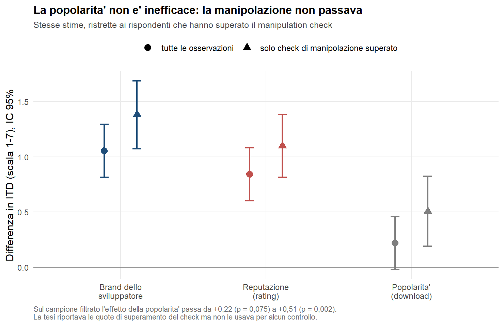

# Determinants of Download on Mobile App Stores — revisione ed estensione

Revisione, validazione ed estensione dell'analisi empirica della tesi magistrale
*Determinants of Download on Mobile App Stores — An Empirical Analysis*
(Luca Bontempi, Chair of Marketing, Eberhard Karls Universität Tübingen e Università di
Pavia, 14 febbraio 2023).

Il lavoro originale è conservato integralmente e senza modifiche in
[`original/`](original/). Tutto ciò che è nuovo vive in [`analysis/`](analysis/) e
[`docs/`](docs/).

**Lavoro originale pubblicato:**
[lucabontempi.com/blog/determinants_of_download_on_mobile_app_stores/](https://lucabontempi.com/blog/determinants_of_download_on_mobile_app_stores/)
· repository originale: `mobile-app-download-determinants`

---

## In breve

La tesi chiedeva quale segnale sulla pagina di uno store — **reputazione** (rating medio),
**popolarità** (numero di download) o **brand dello sviluppatore** — predica meglio
l'intenzione di scaricare un'app. 491 rispondenti, disegno sperimentale a misure ripetute,
tre manipolazioni binarie.

La replica dei risultati del 2023 è **esatta** e i dati sono **integri**. L'inferenza
condotta su quei dati, però, presenta tre difetti che cambiano le conclusioni:

| Conclusione 2023 | Dopo la revisione |
|---|---|
| Il brand è il predittore più efficace | Brand e reputazione **non sono distinguibili** (p = 0,22); entrambi ≫ popolarità |
| La popolarità è inefficace in tutti i modelli | Effetto **positivo e significativo** (β = 0,51; p = 0,002) sui rispondenti che superano il manipulation check |
| Con il confronto la reputazione supera il brand | **Convergono**, non si invertono (1,41 → 0,90 vs 0,69 → 0,91) |
| Interazione a tre vie significativa | **Non confermata** (p = 0,63) con misure ripetute correttamente specificate |
| Nessuna interazione fra variabili focali | **Inconcludente**, non nulla: il disegno era cieco a effetti < 0,76 s.d. |

Motivazioni e numeri completi: [`docs/01-revisione-lavoro-2023.md`](docs/01-revisione-lavoro-2023.md).



---

## Struttura del repository

```
original/            snapshot immutabile del lavoro 2023 — non modificare
  code/              script R originale + note dell'autore
  data/              gli 11 dataset CSV, bit-identici al pacchetto 2023
  tex/               sorgenti LaTeX, bibliografia, frontespizi
  figures/           figure della tesi
  pdf/               PDF finali (Pavia, Tübingen, versioni da stampa)
  README.original.md README del repository originale

analysis/
  R/                 script della revisione, numerati in ordine di esecuzione
  outputs/
    tables/          risultati in CSV
    figures/         figure generate dalle stime corrette
    logs/            output integrale di ogni script — la prova di ogni numero citato

data/
  derived/           dataset ricostruiti in formato long e wide

docs/
  01-revisione-lavoro-2023.md   revisione: cosa regge, cosa no, perché
  02-piano-di-lavoro.md         piano delle analisi successive + changelog
  blog/                         bozze del post per lucabontempi.com
```

---

## Come eseguire l'analisi

**Requisiti:** R ≥ 4.2 con `lme4`, `emmeans`, `ordinal`, `car`, `clubSandwich`, `ggplot2`.

```bash
Rscript -e 'install.packages(c("lme4","emmeans","ordinal","car","clubSandwich","ggplot2"), repos="https://cloud.r-project.org")'
```

Gli script vanno eseguiti **dalla root del repository**, nell'ordine indicato: `03`
produce i dataset che `04`, `05` e `06` consumano.

```bash
Rscript analysis/R/01_replication.R        # replica esatta della Tabella 3.2 della tesi
Rscript analysis/R/02_data_audit.R         # integrità dei dati e confronto con la Tabella 3.1
Rscript analysis/R/03_build_derived.R      # costruisce data/derived/
Rscript analysis/R/04_corrected_inference.R # ANOVA corretta + test della graduatoria
Rscript analysis/R/05_robustness.R         # manipulation check, ordinale, test multipli, potenza
Rscript analysis/R/06_figures.R            # figure
```

Ogni script scrive un log completo in `analysis/outputs/logs/`. Se un numero compare in un
documento di `docs/`, il log corrispondente lo contiene.

### Cosa fa ciascuno script

| Script | Cosa produce | Perché esiste |
|---|---|---|
| `00_setup.R` | percorsi e helper condivisi | i CSV originali hanno un BOM UTF-8 che va gestito in lettura |
| `01_replication.R` | replica delle 9 regressioni e dell'ANOVA | verificare che il lavoro 2023 sia riproducibile prima di criticarlo |
| `02_data_audit.R` | verifica di struttura, coerenza fra file, descrittive | distinguere problemi di dati da problemi di analisi |
| `03_build_derived.R` | `long_measures.csv` (1.473 × 19), `wide_subjects.csv` (491 × 17) | i file originali sono frammentati per modello; il formato long abilita l'analisi pooled |
| `04_corrected_inference.R` | ANOVA a misure ripetute corretta, modello misto, contrasti | la specifica originale non modella le misure ripetute e la graduatoria non è mai testata |
| `05_robustness.R` | controlli su manipulation check, scala ordinale, molteplicità, potenza | quattro verifiche che il lavoro originale non contiene |
| `06_figures.R` | tre figure | comunicare le stime corrette |

---

## Sul rapporto con il lavoro originale

`original/` è uno snapshot in sola lettura. Le correzioni al codice del 2023 — inclusi
due riferimenti a oggetti inesistenti che ne interrompono l'esecuzione — sono
**riprodotte in `analysis/`, non applicate all'originale**, e documentate in
[`docs/02-piano-di-lavoro.md`](docs/02-piano-di-lavoro.md) §6.

I dataset in `original/data/` sono bit-identici a quelli distribuiti nel 2023. Nessuna
analisi di questo repository modifica un dato: `data/derived/` contiene ricostruzioni
ottenute per sola riorganizzazione, verificate contro i file di partenza in
`02_data_audit.R`.

---

## Stato del lavoro

- [x] **Fase 1** — replica, audit, correzione dell'inferenza, robustezza
- [ ] **Fase 2** — effetti sequenziali, eterogeneità fra rispondenti, test di equivalenza,
      curva di specificazione
- [ ] **Fase 3** — estensioni che richiedono l'export grezzo del questionario (demografia,
      item delle scale di involvement)
- [ ] **Fase 4** — post di aggiornamento su lucabontempi.com

Backlog dettagliato con priorità e criteri di accettazione:
[`docs/02-piano-di-lavoro.md`](docs/02-piano-di-lavoro.md).

---

## Citazione

Per il lavoro originale:

> Bontempi, L. (2023). *Determinants of Download on Mobile App Stores — An Empirical
> Analysis*. Tesi di laurea magistrale, Chair of Marketing, Eberhard Karls Universität
> Tübingen / Università di Pavia.

Per la revisione, indicare questo repository e la data del commit.

---

## Licenza

[`LICENSE.md`](LICENSE.md) è ripreso dal repository originale e distingue tre regimi:

| Materiale | In questo repository | Licenza |
|---|---|---|
| Codice R e sorgenti LaTeX | `original/code/`, `original/tex/`, `analysis/R/` | MIT |
| Dataset CSV | `original/data/`, `data/derived/` | CC BY 4.0 |
| Testo della tesi e PDF | `original/pdf/`, testo dei `.tex` | © 2023 Luca Bontempi, tutti i diritti riservati |

Gli script in `analysis/` e i documenti in `docs/` sono materiale nuovo e seguono la
licenza MIT. Nel repository originale i percorsi erano `Data and Code/`, `Figure/` e
`Final Thesis PDFs/`; qui corrispondono rispettivamente a `original/data/` più
`original/code/`, `original/figures/` e `original/pdf/`.
