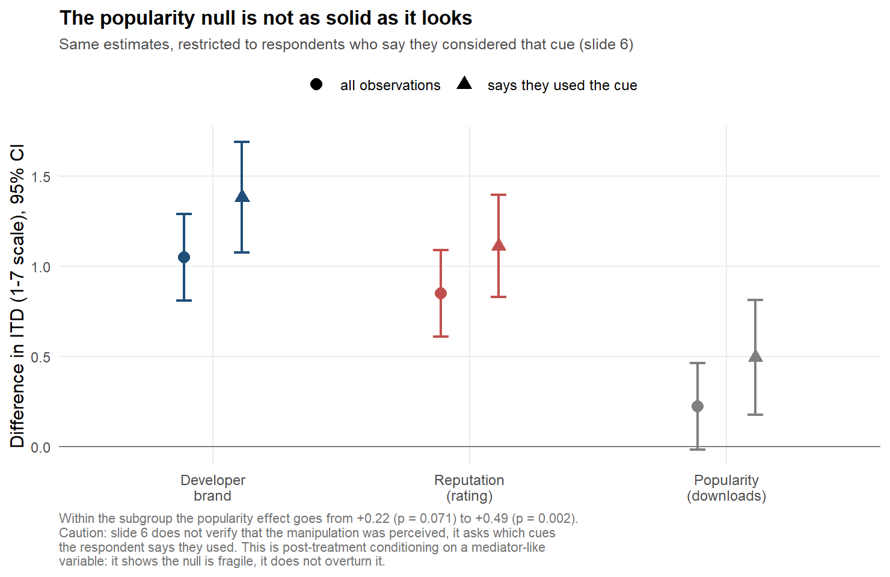

# Determinants of Download on Mobile App Stores — review and extension

Review, validation and extension of the empirical analysis in the master's thesis
*Determinants of Download on Mobile App Stores — An Empirical Analysis*
(Luca Bontempi, Chair of Marketing, Eberhard Karls Universität Tübingen and Università di
Pavia, 14 February 2023).

This repository holds only the new work. The 2023 material is **referenced, not
duplicated**: the sole exception is the 11 CSV datasets in
[`original/data/`](original/data/), which the scripts read directly.

**Read the result first:** the review is written up for a general audience as
[*I Asked an AI to Review My Thesis. It Found Nothing New, Then Found Everything*](https://lucabontempi.com/blog/reopening-my-thesis).
This repository is the evidence behind it.

**Original work:**
[github.com/lucabnt/mobile-app-download-determinants](https://github.com/lucabnt/mobile-app-download-determinants)
· published at
[lucabontempi.com/blog/determinants_of_download_on_mobile_app_stores/](https://lucabontempi.com/blog/determinants_of_download_on_mobile_app_stores/)

---

## In short

The thesis asked which cue on an app store listing — **reputation** (average rating),
**popularity** (download count) or **developer brand** — best predicts the intention to
download an app. 491 respondents, a repeated-measures experimental design, three binary
manipulations.

The 2023 results **replicate exactly** and the data is **internally consistent**. What does
not hold up is the inference drawn from it — and, in one case, the construction of a
stimulus:

| 2023 conclusion | After the review |
|---|---|
| Brand is the most effective predictor | **True of the first app shown** — the uncontaminated judgement the design was built to measure (+0.76, p = 0.031) — and not true as a general claim: averaged over the three judgements brand and reputation are **indistinguishable** (p = 0.24). The finding needed its scope |
| Popularity is ineffective in all models | **Not a solid null**: it works on the first app shown (+0.45, p = 0.022), it vanishes among respondents who say they looked at downloads (β = 0.49, p = 0.002), and the low-popularity stimulus showed 10K+ downloads alongside 84K reviews. What happens after the first app this design cannot say |
| Under comparison, reputation overtakes brand | They **converge**, they do not swap (1.42 → 0.89 vs 0.69 → 0.92) |
| Three-way interaction significant | **Not confirmed** (χ²(4) = 6.31, p = 0.18) once repeated measures are specified correctly |
| No interaction between focal variables | **Inconclusive**, not null: the design was blind to effects below 0.76 s.d. — and the terms tested are carryover effects from apps seen earlier, not factorial interactions, since only one cue is manipulated per screen |

Full reasoning and figures: [`docs/01-review-of-2023-work.md`](docs/01-review-of-2023-work.md).
Each of these conclusions was then stress-tested against criteria fixed before the tests were
run — a specification curve over every defensible model, and equivalence tests on the null
results. All of them survived: §12 of the review.



Two further defects concern how the data was built, and surfaced by reading the appendices:
the low-popularity stimulus is internally impossible; and 18 respondents have mean-imputed
involvement scores while 11 who completed the survey were left out, none of it documented.

---

## Repository structure

```
original/
  data/              the 11 CSV datasets, bit-identical to the 2023 package — do not modify
  README.md          what is versioned here and what is referenced upstream

analysis/
  R/                 review scripts, numbered in execution order
  outputs/
    tables/          results as CSV
    figures/         14 figures generated from the corrected estimates
    logs/            full output of every script — the evidence behind every number quoted

data/
  derived/           datasets rebuilt in long and wide format

docs/
  01-review-of-2023-work.md   the review: what holds, what does not, why
  02-work-plan.md             plan for further analysis + change log
  03-new-analyses.md          what else the data can answer, each model explained
```

---

## Running the analysis

**Requirements:** R ≥ 4.2 (developed on 4.6.1) with `lme4`, `lmerTest`, `emmeans`,
`ordinal`, `car`, `clubSandwich`, `ggplot2`. The Bayesian script additionally needs `brms` and a
working Stan backend; `cmdstanr` with CmdStan 2.39 is the one used here.

```bash
Rscript -e 'install.packages(c("lme4","lmerTest","emmeans","ordinal","car","clubSandwich","ggplot2"), repos="https://cloud.r-project.org")'
```

Scripts must be run **from the repository root**, in the order shown: `03` produces the
datasets that `04`, `05` and `06` consume.

```bash
Rscript analysis/R/01_replication.R         # exact replication of Table 3.2 of the thesis
Rscript analysis/R/02_data_audit.R          # data integrity and comparison against Table 3.1
Rscript analysis/R/03_build_derived.R       # builds data/derived/
Rscript analysis/R/04_corrected_inference.R # correct ANOVA + test of the ranking
Rscript analysis/R/05_robustness.R          # slide-6 check, ordinal model, multiplicity, power
Rscript analysis/R/06_figures.R             # figures
Rscript analysis/R/07_specification_curve.R # every defensible specification of the ranking
Rscript analysis/R/08_equivalence.R         # equivalence tests on the null results
Rscript analysis/R/10_sequence_effects.R    # does what came before change what comes next?
Rscript analysis/R/11_heterogeneity.R       # do people differ in what moves them?
Rscript analysis/R/12_response_scale.R      # is the 1-7 scale a ruler?
Rscript analysis/R/14_posterior_probabilities.R  # p-values restated as probabilities
Rscript analysis/R/15_bayesian_brms.R       # the same findings as a full Bayesian model
Rscript analysis/R/16_figures_extended.R    # the explanatory figures
Rscript analysis/R/17_centering_check.R     # the thesis's mean-centred outcome, assessed
Rscript analysis/R/18_first_exposure.R      # the first-app-only estimand, and the ranking on it
Rscript analysis/R/19_model_specifications.R # the thesis's three models, judged one by one
```

`15_bayesian_brms.R` picks its Stan backend by trying a trivial model first: `cmdstanr` where it
is available, `rstan` otherwise, and a clear message instead of a crash if neither compiles.

Two scripts need a private copy of the raw questionnaire export and skip cleanly without it:

```bash
RAW_EXPORT=/path/to/export.csv Rscript analysis/R/09_raw_export_checks.R
RAW_EXPORT=/path/to/export.csv Rscript analysis/R/13_demographics_quality.R
```

Every script writes a complete log to `analysis/outputs/logs/`. If a number appears in a
document under `docs/`, the corresponding log contains it.

### What each script does

| Script | What it produces | Why it exists |
|---|---|---|
| `00_setup.R` | shared paths and helpers | the original CSVs carry a UTF-8 BOM that must be handled on read |
| `01_replication.R` | replication of the 9 regressions and the ANOVA | verify the 2023 work is reproducible before criticising it |
| `02_data_audit.R` | structure, cross-file consistency (every shared column, with range and centring checks), descriptives, imputations, redundancies | separate data problems from analysis problems |
| `03_build_derived.R` | `long_measures.csv` (1,473 × 19), `wide_subjects.csv` (491 × 17) | the original files are fragmented per model; long format enables pooled analysis. Involvement covariates come from the model files: the ANOVA file encodes 18 imputed respondents incorrectly |
| `04_corrected_inference.R` | correct repeated-measures ANOVA, mixed model, contrasts | the original specification does not model repeated measures, and the ranking is never tested |
| `05_robustness.R` | checks on slide 6, ordinal scale, multiplicity, power, involvement moderation, and the estimates without the 18 mean-imputed respondents | checks the original work does not contain |
| `06_figures.R` | three figures | communicating the corrected estimates |
| `07_specification_curve.R` | the brand-vs-reputation contrast under all 24 defensible specifications | shows whether the ranking is a finding or an analytic choice |
| `08_equivalence.R` | equivalence verdicts on the null results, plus the slide-6 reporting test | "not significant" is not the same as "no effect" |
| `09_raw_export_checks.R` | aggregate checks on the raw survey export (optional) | verifies the chain from raw answers to the thesis datasets; needs a private copy of the export in `RAW_EXPORT`, skips cleanly without it |
| `10_sequence_effects.R` | contrast and assimilation from the apps seen earlier | the thesis asked this on a third of the data; in long format it uses 982 observations |
| `11_heterogeneity.R` | random slopes: do respondents differ in cue sensitivity? | an average effect is only useful if it describes people |
| `12_response_scale.R` | cutpoints of the 1–7 scale, and whether the spacing matters | ordinary regression assumes a ruler; this tests the assumption |
| `13_demographics_quality.R` | demographic moderation and response-quality robustness (optional) | the thesis collected demographics and never used them |
| `14_posterior_probabilities.R` | the findings restated as probabilities | "89% likely" answers the question a reader asks; a p-value does not |
| `15_bayesian_brms.R` | the same findings as a full Bayesian model, and a comparison against the approximation | the two agree within 3.9 percentage points, which is how we know the approximation was sound |
| `16_figures_extended.R` | eight figures explaining the results | most of these findings are easier to see than to read |
| `17_centering_check.R` | what the thesis's mean-centred ITD changes, and what it hides | a choice the review had verified without ever assessing it |
| `18_first_exposure.R` | the ranking tested on the first app shown, where the 2023 design aimed it | restricting to the first judgement protects it from comparison effects; the review had read the restriction as mere fragmentation |
| `19_model_specifications.R` | M1, M2, M3 and the ANOVA judged separately, against the purpose each states | "fragmentation" was one word for four different decisions, two of which turn out to be sound |

---

## Relationship to the original work

The 2023 material lives in its own repository:
[**lucabnt/mobile-app-download-determinants**](https://github.com/lucabnt/mobile-app-download-determinants).
It is not duplicated here. The original R script, LaTeX sources, figures and final PDFs are
referenced; the full path mapping is in [`original/README.md`](original/README.md).

The one exception is `original/data/`: the 11 CSVs are versioned because every script reads
them, and without them a clean clone would not be reproducible. They are bit-identical to
those distributed in 2023.

**No original file is modified.** Fixes to the 2023 code — including two references to
non-existent objects that abort its execution — are **reproduced in `analysis/`, not applied
upstream**, and documented in [`docs/02-work-plan.md`](docs/02-work-plan.md) §6. No analysis
in this repository alters any data: `data/derived/` contains reconstructions obtained purely
by reorganisation, verified against the source files in `02_data_audit.R`.

---

## Status

- [x] **Phase 1** — replication, audit, corrected inference, robustness
- [x] **Phase 2, Step 2A** — the three headline claims stress-tested against a rule fixed in
      advance; all three survive (§12 of the review)
- [x] **Phase 2, rest** — sequence effects, respondent heterogeneity, response scale, posterior
      probabilities ([`docs/03-new-analyses.md`](docs/03-new-analyses.md))
- [x] **Phase 3** — raw export recovered (kept private); blocking ambiguities resolved,
      demographics and response-quality checks done. Still open: the 43 respondents who dropped
      out early, who are not in the export
- [x] **Phase 4** — the update is published on lucabontempi.com:
      [*I Asked an AI to Review My Thesis. It Found Nothing New, Then Found Everything*](https://lucabontempi.com/blog/reopening-my-thesis).
      Its draft is deliberately not versioned here: the post belongs on the site, the evidence
      belongs in this repository

Detailed backlog with priorities and acceptance criteria:
[`docs/02-work-plan.md`](docs/02-work-plan.md).

---

## Citation

**To point a reader at the review, link the post rather than this repository.** It states
every finding in plain language, carries the figures, and links back here for the evidence:

> Bontempi, L. (2026). *I Asked an AI to Review My Thesis. It Found Nothing New, Then Found
> Everything*. https://lucabontempi.com/blog/reopening-my-thesis

To cite the analysis itself — the code, the logs and the decision rules fixed before the tests
were run — cite the repository and the commit date:

> Bontempi, L. (2026). *Determinants of Download on Mobile App Stores — review and extension*.
> GitHub: lucabnt/mobile-app-download-determinants-update.

For the original work:

> Bontempi, L. (2023). *Determinants of Download on Mobile App Stores — An Empirical
> Analysis*. Master's thesis, Chair of Marketing, Eberhard Karls Universität Tübingen /
> Università di Pavia.

---

## Licence

[`LICENSE.md`](LICENSE.md) is carried over from the original repository and distinguishes
three regimes:

| Material | Licence | Where it lives |
|---|---|---|
| CSV datasets | CC BY 4.0 | `original/data/`, `data/derived/` — versioned here |
| 2023 R code and LaTeX sources | MIT | [upstream](https://github.com/lucabnt/mobile-app-download-determinants) |
| Thesis text and PDFs | © 2023 Luca Bontempi, all rights reserved | [upstream](https://github.com/lucabnt/mobile-app-download-determinants) |

The scripts in `analysis/` and the documents in `docs/` are new material under the same MIT
licence. CC BY 4.0 on the data requires attribution and an indication of changes made:
`data/derived/` is derived material, and the transformations producing it are documented in
[`analysis/R/03_build_derived.R`](analysis/R/03_build_derived.R).
