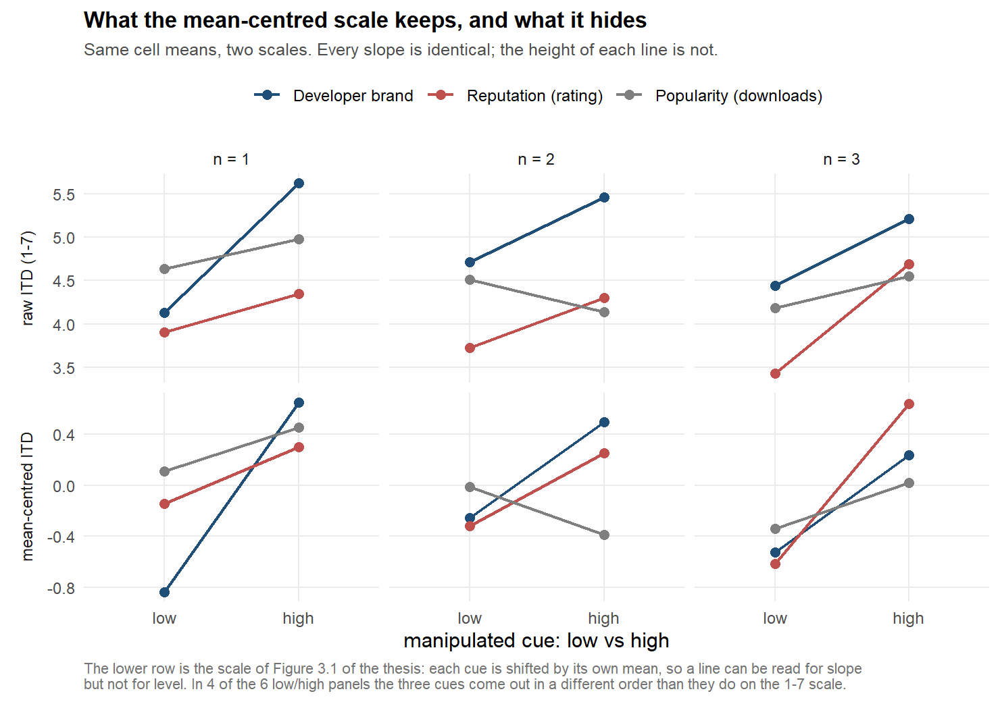

# Review of the 2023 work

**Subject:** *Determinants of Download on Mobile App Stores — An Empirical Analysis*
(master's thesis, Chair of Marketing, Universität Tübingen / Università di Pavia,
14 February 2023)

**Status:** review completed against the unmodified original material, published at
[github.com/lucabnt/mobile-app-download-determinants](https://github.com/lucabnt/mobile-app-download-determinants).
The 11 datasets are also versioned here in [`original/data/`](../original/data/) because
the scripts read them directly. Every figure quoted below is reproducible with the
scripts in [`analysis/R/`](../analysis/R/); the full logs are in
[`analysis/outputs/logs/`](../analysis/outputs/logs/).

---

## 1. Executive summary

The work **replicates exactly and the data are internally consistent**. The nine
regressions of Table 3.2 reproduce digit for digit, and the datasets show no internal
inconsistencies, no missing values and no discrepancies against the published descriptive
statistics.

The problems are not in the data. They are in how inference was drawn from it. Three
defects are substantive and change the conclusions.

| # | Problem | Effect on the conclusions |
|---|---|---|
| **A** | The repeated-measures ANOVA does not model repeated measures (`Error(lfdn)` with `lfdn` an integer) | The three-way interaction reported as significant is **not confirmed**: χ²(4) = 6.31, p = 0.18 on the mixed model. The split-plot ANOVA divides that same term between its two strata (p = 0.056 between respondents, p = 0.63 within), so neither of those two numbers is the test on its own — §3.1 |
| **B** | The brand > reputation > popularity ranking is inferred by eyeballing coefficients estimated on different subsamples, with no test of the difference | It depends on the quantity. Averaged over the three judgements **brand and reputation are indistinguishable** (p = 0.24). On the first app shown — the uncontaminated judgement the design was built to measure — **brand does lead** (+0.76, p = 0.031 Holm; +1.36 log-odds, p = 0.002 in the thesis's own sample). The thesis stated that scope itself, in the abstract; it tested neither half — §3.2 |
| **C** | The "manipulation check" is reported and, by the author's deliberate choice, not used — but it is not a perception check at all, it is a post-treatment self-report | The thesis's most-quoted result, "popularity is surprisingly ineffective", **is fragile**: among respondents who say they looked at downloads the effect goes from +0.22 (p = 0.071) to +0.49 (p = 0.002). This does not overturn it (§3.3), but it removes the null's solidity |

Three further problems concern the calibration of the evidence rather than its direction:

- **81 coefficients estimated, no multiplicity correction.** Of the 23 significant at
  p < 0.10, **2** survive Holm and **4** survive FDR < 0.05 — in both cases essentially
  the brand main effect alone.
- **Two of the three involvement moderations do not replicate** in a pooled model.
- **The claim "no two-way interaction between focal variables" is inconclusive, not
  null:** the design could only detect interactions ≥ 0.75–0.98 standard deviations.

Two further defects concern the construction of the stimuli and of the data, and surfaced
by reading the appendices rather than the models:

- **The low-popularity stimulus is internally impossible** (10K+ downloads alongside 84K
  reviews). This is a confound in the very manipulation that produces the thesis's most
  discussed result (§3.3).
- **18 of 491 respondents have mean-imputed involvement scores**, and **11 respondents who
  reached the end were excluded**, neither documented anywhere (§2.4). The raw export
  explains all of the imputation and ten of the exclusions; one exclusion has no reason
  visible in the data.

The picture that emerges does not demolish the work. It shifts its centre of gravity: the
sturdier story is not "brand wins" but **"brand and reputation are equivalent as long as
the user looks at a single app; comparison makes them converge; popularity counts for
little, and how little cannot be determined with these stimuli"**.

---

## 2. What was verified and held up

### 2.1 Exact replication of Table 3.2

[`01_replication.R`](../analysis/R/01_replication.R) reproduces the nine regressions using
the original specification. Agreement to four decimal places on every coefficient,
standard error, R², adjusted R², sample size and manipulation-check rate. No discrepancies.

Replicated focal coefficients:

| Model | β | p |
|---|---|---|
| M1 (rep) | 0.4986 | 0.0596 |
| M1 (pop) | 0.3611 | 0.0944 |
| M1 (brand) | 1.5289 | < 0.001 |
| M2 (rep) | 1.3351 | 0.0014 |
| M2 (pop) | 0.5340 | 0.2560 |
| M2 (brand) | 1.0347 | 0.0180 |
| M3 (rep) | 0.4576 | 0.0895 |
| M3 (pop) | 0.3677 | 0.0929 |
| M3 (brand) | 1.5028 | < 0.001 |

### 2.2 Data integrity

[`02_data_audit.R`](../analysis/R/02_data_audit.R) verifies:

- **Design structure.** 491 respondents × 3 measures = 1,473 observations. Each subject
  sees each focal variable exactly once and each position exactly once: a Latin square,
  correctly randomised (no duplicates).
- **One version per cue per respondent.** Each focal variable exists as **two** screenshots,
  a strong and a weak one (Appendix A: Fig. A.1 reputation, A.2 popularity, A.3 brand — six
  stimuli in all), and each respondent is shown exactly **one** of the two. Verified on the
  data: all 1,473 subject × cue pairs carry a single level of `x`, so no respondent ever sees
  both versions of the same cue. The split is 256/235 high/low for brand, 238/253 for
  reputation, 247/244 for popularity, and all eight combinations of the three levels occur
  across respondents (48 to 70 each). The thesis states the rule in §3.1: the order of the
  three slides is random, and so is *"which one out of the two screenshots corresponding to
  values of a variable"* is shown.
- **What follows from it.** The manipulation is **within subject across cues and between
  subjects within a cue**. Every effect of `x` reported anywhere — in the thesis and in this
  review — is therefore a comparison between different people, and the repeated measures buy
  precision on the person, not a high-vs-low contrast inside the same person. This is the
  structural reason why the interactions between focal variables are underpowered (§4.3) and
  why a within-person perception check was never available (§3.3).
- **Cross-file consistency.** Merging on `lfdn` between the model files and the ANOVA file
  yields 0 mismatches on `y`, 0 on `x` and 0 on `comp` for all three focal variables.
  **But not on the involvement covariates — corrected 2026-09-18.** This check stopped at
  `y`, `x` and `comp`, and the first version of this bullet reported it as clean. An
  independent re-computation (not published) extended it to the three
  involvement columns and found 18 respondents — exactly the mean-imputed ones of §2.4 —
  where the ANOVA file disagrees with every model file. The model files store the imputed
  score as the mean, so its centred value is 0; the ANOVA file stores it as if the missing
  score had been **0**, so its centred value is −mean (−5.33, −4.69, −4.48). Those values
  are impossible: a 1–7 scale centred on its mean cannot go below about −4.3.
  - **The thesis is unaffected.** The nine model files agree with one another to 10⁻¹³ and
    carry the correct value, and the thesis's ANOVA does not use involvement at all.
  - **This review was affected.** `03_build_derived.R` copied the involvement columns from
    the ANOVA file, so every pooled model with involvement controls inherited the 18 values.
    It now rebuilds them from the model files, and `02_data_audit.R` §4b checks every centred
    column for cross-file agreement, possible range and zero mean. The whole pipeline was
    re-run: no conclusion changes, one strengthens (§4.2), and every number quoted in this
    document is the corrected one.
- **Subsamples.** The M1 (n = 1) and M2 (n = 3) sample sizes match exactly those expected
  from the repeated-measures file: 149/189/153 and 196/143/152, each summing to 491.
- **Centring.** `y_i_mc` is `y_i` centred on the mean **within focal variable** (maximum
  error 0.000000). The three involvement measures are centred on the overall mean **in the
  model files**; in the ANOVA file their columns average −0.054, −0.029 and −0.100 because of
  the 18 values above. What the outcome centring does and does not cost is assessed in §2.5.
- **Missing values.** Zero, across all eleven files.
- **Descriptive statistics.** Means and standard deviations in Table 3.1 match the data.

### 2.3 Two minor discrepancies in Table 3.1

Neither changes any conclusion, but both should be fixed in any republication:

- The standard deviations are **population** SDs (divided by *N*), not sample SDs
  (*N* − 1). For instance `y_rep` is reported as 1.7077 against a sample value of 1.7095.
  Difference ~0.001.
- The `comp_i` row reports **design** values (mean 2/3 = 0.6667; s.d. 0.4714) rather than
  realised ones. In the sample the mean varies by focal variable: 0.6965 for reputation,
  0.6883 for brand, 0.6151 for popularity.

### 2.4 Undocumented mean imputation

The involvement scales have 3 items (`inv_app`, `inv_dl`) and 8 items (`inv_cat`) on a 1–7
range, so the scale means must be multiples of 1/3 and 1/8. Each scale instead contains
**one value that is not attainable on the scale and that equals the scale mean exactly** —
the signature of mean imputation:

| Scale | Items | Imputed cases | Published s.d. | s.d. excluding imputed |
|---|---|---|---|---|
| `inv_app` | 3 | 5 (1.0%) | 1.0533 | 1.0587 |
| `inv_dl` | 3 | 3 (0.6%) | 1.2987 | 1.3027 |
| `inv_cat` | 8 | 11 (2.2%) | 1.0640 | 1.0762 |

In total 18 of 491 respondents (3.7%) have at least one imputed scale, one has two. The
numerical impact is negligible — Table 3.1's standard deviations are understated by ~0.01 —
but the choice is declared neither in the thesis nor in the code, and on a moderator it
introduces attenuation towards zero precisely in the imputed cases.

**Confirmed from the raw export (2026-09-11, [`09_raw_export_checks.R`](../analysis/R/09_raw_export_checks.R)).** The imputed rows are exactly the
rows in which a respondent saw an item and skipped it (EFS code 0). The same export reveals
a second undeclared choice: it holds **502** respondents who reached the end, not 491. Of the
11 left out:

- **10 were never shown a whole block** (EFS code −77): all 10 missed the involvement pages,
  and one of them the app screens as well. Eight answered within the same two-day window
  early in fieldwork, which is consistent with a temporary routing problem — an
  interpretation, not something the export records.
- **1 had complete, plausible data** — every block shown, an ordinary completion time, valid
  answers throughout — and no reason for its exclusion is visible in the export. It is
  present in every export snapshot from the first one, so it was not a late arrival missed
  when the workbook was built.

The first rule is coherent: shown but skipped → imputed, never shown → excluded. The eleventh
exclusion is not explained by anything in the data. The author recalls that the exclusions
were deliberate and probably test runs, but not the specific reason — and the export's
`tester` flag is 0 for all 502 respondents, so no test run was marked as one. The thesis declares none of this, and its "491 of 545 completed"
silently counts all 11 as non-completers. One respondent more or less has no visible effect
on the estimates; the point is documentation.

### 2.5 The mean-centred ITD: assessed, and it holds

The 2023 work carries two centrings, and they are not the same kind of decision. The three
involvement measures are centred on the overall mean, which is standard practice in a model
with interactions: it makes the coefficient of *x* readable as the effect at *average*
involvement rather than at involvement zero, a value no respondent has. The outcome is
centred **within focal variable** (`y_i_mc`) and is used only to draw Figure 3.1.

This section was added on 2026-09-12 at the author's prompting: the review had verified how
`y_i_mc` is built (§2.2) without ever asking what the choice costs.
[`17_centering_check.R`](../analysis/R/17_centering_check.R) asks.

**What is subtracted.** Not one constant but three, one per cue:

| Cue | Mean ITD subtracted | Deviation from the within-cue rule |
|---|---|---|
| Developer's brand | 4.9674 | < 5e-10 |
| Reputation | 4.0468 | < 5e-10 |
| Popularity | 4.5255 | < 5e-10 |

The overall mean is 4.5132, so a single overall centring would have been a different
operation. The three cues are moved to a common zero of their own.

**Would any estimate have changed?** The general rule is that subtracting a constant per
group from the outcome is harmless *if and only if* the model already contains that group as
a term, because the constants are then absorbed by the group intercepts. The thesis's nine
regressions are estimated one cue at a time — there the cue *is* the sample — and the pooled
models of this review carry `focal` as a factor. Either way the constants are absorbed.
Verified rather than asserted, refitting the pooled mixed model on both outcomes:

- every coefficient except the two cue intercepts is identical to within 5 × 10⁻¹¹, and so
  is every standard error and both variance components;
- the two cue intercepts move by exactly the difference between the centring constants
  (+0.9206 for reputation, +0.4420 for popularity);
- the manipulation effects that carry the ranking — 1.050, 0.848, 0.221 — are unchanged;
- in the repeated-measures ANOVA, the only line that moves is the `focal` main effect, and
  it moves to exactly nothing (F = 0.000, p = 1.000). The tests the thesis interprets are
  identical: *x* F = 98.99, `focal × x` F = 9.90, the three-way term F = 0.64.

Had every model in the thesis used the centred outcome, the results would have been the same
minus one effect that would have been structurally zero. **The choice is sound.**

**What the centred scale costs the reader.** Because each cue is shifted by its own mean, the
vertical position of a line in Figure 3.1 is not a level of intention to download: it is a
deviation from that cue's own average. Slopes survive; heights do not. In 4 of the 6
low/high panels the three cues come out in a different order on the centred scale than they
do on the 1–7 scale: popularity is the highest line in all three "low" panels once centred,
and in only one of them on the raw scale. The one reading the thesis takes from the figure,
the parallel between *n* = 1 and *n* = 3, is about slopes and is therefore safe.



**The dimension that was left untouched.** In a repeated-measures design the variance worth
handling is between respondents: it is 41% of the total (ICC, §3.1). Cue centring removes
5.1% of the variance of ITD; respondent centring would remove 56.7%. But centring cannot
substitute for a respondent term in the model, and doing it to the outcome alone would have
been actively harmful, because each respondent's mean contains their own treated
observation:

| Estimator | Brand | Reputation | Popularity |
|---|---|---|---|
| OLS, no respondent term | 0.976 | 0.800 | 0.116 |
| Mixed model, random intercept | 1.050 | 0.846 | 0.224 |
| Respondent fixed effects (within) | 1.097 | 0.879 | 0.294 |
| **Outcome centred by respondent only** | **0.723** | **0.565** | **0.191** |

(Same fixed part in all four, without the involvement controls, so that the only difference is
how respondents are handled. The within estimator is identified because the level of `x` varies
across a respondent's three cues, not because anyone saw a cue twice: see §2.2.) The three legitimate estimators bracket each other, as they
should. Centring the outcome by respondent attenuates every effect by about a third — 34%,
36% and 35% against the within estimate. It is a trap the thesis did not fall into, because
it centred on the cue, which its models control for, and not on the respondent.

**Verdict.** The mean-centred ITD is a defensible plotting device and carries no estimate.
Two qualifications are worth putting in any republication: the label *mean-centered ITD*
should say *centred within focal variable*, and the figure should warn that only slopes are
comparable. The variance that needed handling in this design was never a matter of centring:
it needed the respondent term that `Error(lfdn)` failed to provide (§3.1).

### 2.6 Redundancies and leftovers in the files

Two observations that do not affect the results but explain the file contents:

- **`M plots.csv` is redundant.** It holds the same 1,473 rows as `M ANOVA_RM.csv` on the
  same columns, minus `n_name` and `x_i_name`. Verified with `all.equal`: no additional
  data.
- **The M2 files contain four columns no model uses.** `ITD_pop` and `ITD_brand` are
  top-3-box dichotomisations (`y ≥ 5`) of the ITD measured at position 1 or 2;
  `ITD_pop_2` and `ITD_brand_2` are those same ITDs mean-centred. They are leftovers from
  abandoned exploration.

---

## 3. The defects that change the conclusions

### 3.1 (A) The repeated-measures ANOVA does not model repeated measures

The original script contains:

```r
ANOVA.aov <- aov(y_i ~ i_name*x_i_name*n_name + Error(lfdn), data = data1)
```

`lfdn` is read as an **integer**. `aov()` therefore treats it as a continuous covariate
rather than a grouping factor: the `Error: lfdn` stratum collapses to 1 degree of freedom
with no residuals, and every test lands in the `Within` stratum on 1,454 residual df —
that is, an ANOVA over independent observations. The repeated-measures structure, which is
the heart of the design, never enters the model.

That the data are strongly clustered by respondent is shown by the mixed-effects model:
**ICC = 0.41**. Forty-one percent of the variance in ITD is between-person variance.
Ignoring it is not a detail.

With `subject` as a factor, the tests change:

| Term | Thesis (original specification) | Correct specification (*Within* stratum) |
|---|---|---|
| focal variable *i* | F = 42.19 *** | F = 73.96 *** |
| manipulation *x* | F = 60.84 *** | F = 98.99 *** |
| position *n* | F = 2.37 (p = 0.094) | F = 4.03 (p = 0.018) |
| *i* × *x* | F = 10.28 *** | F = 9.90 *** |
| **i × x × n** | **F = 2.68 (p = 0.030)** | **F = 0.64 (p = 0.633)** |

The three-way interaction, which the thesis text presents as *"further foundations for
subsequent analyses"*, **does not survive**. The mixed model confirms this
(χ² = 6.31, 4 df, p = 0.177).

A caution on that table, added 2026-09-15. Because the level of a cue is assigned **between**
respondents (§2.2), `aov` with `Error(subject)` cannot place the terms involving *x* in a
single stratum: it splits them, and prints the three-way interaction twice — F = 2.33
(p = 0.056) between respondents and F = 0.64 (p = 0.633) within. The column above shows the
*Within* half. The test that uses both halves is the mixed-model one, p = 0.177, and that is
the number this review should quote; earlier versions quoted 0.633 alone, which reports the
half that vanishes and omits the half that does not. The conclusion is unchanged — the
interaction is not significant and the 2023 claim stays withdrawn — but it does not vanish as
completely as that figure suggested.

**A related transcription error.** The text reports *F*(2, 4) = 42.187 and *F*(1, 4) =
60.841. The denominator degrees of freedom are not 4 but 1,454 (the "4" appears to have
been taken from the *Df* column of another row of the `aov` table). The *F* values and
p-values are correct; the published df are not.

### 3.2 (B) The ranking is never tested

The central claim — *"developer's brand is generally the most decisive element"* — comes
from comparing β = 1.5289 (M1 brand), β = 0.4986 (M1 rep) and β = 0.3611 (M1 pop). But
these three coefficients come from **three regressions on three disjoint subsamples** (153,
149 and 189 different respondents). Comparing them is not a test: nowhere in the thesis is
there a statistic that answers "does brand really beat reputation?".

The pooled model on all 1,473 observations, with a random intercept by respondent, answers
it. The `focal × manipulation` interaction is needed (LRT: χ² = 24.80, 2 df, p < 0.001), so
the effects *do* differ. But the pairwise contrasts (Holm-corrected) show **where** the
difference lies:

| Contrast | Δβ | 95% CI | p (Holm) |
|---|---|---|---|
| reputation − brand | −0.202 | [−0.615, 0.210] | **0.240** |
| popularity − brand | −0.829 | [−1.246, −0.412] | < 0.001 |
| popularity − reputation | −0.626 | [−1.037, −0.216] | 0.0005 |

The effects estimated on the whole sample:

| Variable | β | 95% CI | Cohen's *d* |
|---|---|---|---|
| Brand | +1.050 | [0.810, 1.290] | 0.66 |
| Reputation | +0.848 | [0.608, 1.088] | 0.50 |
| Popularity | +0.221 | [−0.019, 0.461] | 0.14 |

**Brand and reputation are not statistically distinguishable.** The thesis's three-step
hierarchy is really a two-step one: {brand, reputation} ≫ popularity.

What the fragmentation cost is visible in the reputation estimate, and it decomposes into two
halves. M1 puts it at 0.4986 (p < 0.10) on 149 observations; one model on all the data puts the
**same quantity** — the first app seen — at 0.684, and the average across the three judgements at
0.848. So of the two-thirds rise, about half is precision recovered on the question the thesis
was asking, and half is the change of question. Only the first half is a cost of the split
sample; the second is the difference between two estimands, and is discussed below.

**The scope of the claim — a correction to this section, 2026-09-15.** The author's reason
for restricting Model 1 to the first app shown was recorded after this section was written:
the first judgement is the only one **not conditioned by the apps seen before it**. That is a
design decision protecting an estimand, not an accident of sampling, and it changes what this
section can fairly claim. [`18_first_exposure.R`](../analysis/R/18_first_exposure.R) works it
through.

Three points, in order.

1. **The threat is plausible and partly visible.** On the 982 later measurements, the average
   level seen earlier pulls the current rating *down* — a contrast effect of −0.18 on its own
   (p = 0.16) and −0.34 with the interaction in the model (p = 0.038); see §2 of
   [`03-new-analyses.md`](03-new-analyses.md). A design choice does
   not need a significant threat to be justified; it needs a plausible one, and removing it
   costs only precision.
2. **On the quantity the design targeted, the ranking holds.** Tested rather than eyeballed,
   at first exposure:

   | Contrast, first app shown | Δβ | p (Holm) |
   |---|---|---|
   | brand − reputation | **+0.755** | **0.031** |
   | brand − popularity | **+0.989** | **0.003** |
   | reputation − popularity | +0.233 | 0.43 |

   From the thesis's own sample of 491 first measurements the gap is larger: +1.02
   (p = 0.0068), and +1.36 log-odds (p = 0.0023) in the ordinal version. The specification
   curve agrees and says where: **all four specifications that put brand significantly ahead
   are first-position ones** (§12.1).
3. **What was wrong was the fragmentation, not the restriction.** Nine regressions on disjoint
   subsamples share no parameters, so no contrast between cues can be tested — and none was.
   One model on all 1,473 answers, with the cue interacted with position, returns the same
   first-exposure estimate (+0.755 against +1.02, well within one standard error) *and*
   supplies the test, *and* says what happens afterwards.

So the honest form of finding (B) is a statement with a scope attached. **At first exposure
brand leads reputation; averaged over the three judgements the two are indistinguishable.**
The thesis states both, in the abstract: brand is *"generally the most decisive element, but,
when comparison between apps is introduced in the model, it loses its effectiveness"*. It tests
neither: the first half holds, the second is not established (p = 0.10, §6). *(Corrected
2026-09-21: an earlier version said the thesis had dropped this scope. It had not.)*

Two things follow that the 2023 work did not have:

- **M3's β = 1.5028 is not an overall effect.** With `comp_i` and its interaction in the
  model, that coefficient is the effect at `comp_i` = 0 — first exposure again — not the
  effect "independently from *n*", as the text reads it.
- **The M1-to-M2 reversal is still not established.** The interaction that would license
  "the ranking changes with position" is not significant: χ²(4) = 6.37, p = 0.17 by position,
  χ²(2) = 4.66, p = 0.097 for first-versus-later. The pattern in the point estimates is
  suggestive and it is reported as such throughout this review (§6, §12.1), but the ordering
  at first exposure is the part that the data establishes.

### 3.3 (C) The manipulation check is reported but not used — and it is not a manipulation check

**Author's clarification (2026-09-12).** Measuring this and then *not* using it was a
deliberate design choice, not an oversight: the question was meant to be collected and
reported, never to gate the sample or condition an estimate. Given what it actually measures
— see below — that decision was the right one, and this section should be read as a
criticism of the **label** and of what the thesis leaves unsaid about it, not of the choice.
What follows from the choice, and is not stated in the thesis, is that the design contains no
verification that the manipulation was perceived.

**What it actually measures.** Slide 6 of the questionnaire (Appendix B) is **a single
multiple-choice question**, asked once at the end, about the three apps collectively:

> *"Please indicate which factors you took into consideration when evaluating the apps on
> the previous slides."*

followed by nine tick boxes: *Review rating, Number of downloads, Developer brand, App's
name, App's icon, Number of reviews, App's screenshots, PEGI rate, "About this app"*.
`man_check_i` equals 1 if the matching box is ticked.

It is therefore not a check that the manipulation was perceived: it is a **self-report of
which cues the respondent says they used**, collected after treatment. The thesis itself
calls it *"a compromise (and not ideal) version"*. Three consequences, all verifiable in
the data ([`02_data_audit.R`](../analysis/R/02_data_audit.R) §12):

1. **It is a compositional measure.** Ticking one box comes at the expense of others. The
   correlations between the three outcomes within subject confirm it: rep–pop = +0.305, but
   brand–rep = −0.067 and brand–pop = −0.091. An attention measure would show uniformly
   positive correlations.
2. **It cannot vary by position**, being a single global question. The rates are indeed
   flat (68.4% / 69.2% / 67.4% for *n* = 1, 2, 3). That flatness is structural and says
   nothing about memory decay.
3. **The three checks count different numbers of boxes.** The raw export and the original
   processing workbook (resolved 2026-09-11, [`09_raw_export_checks.R`](../analysis/R/09_raw_export_checks.R)) show that `man_check_brand` is 1 if
   *any of three* boxes is ticked, `man_check_rep` if *either of two*, and `man_check_pop`
   only if its *single* box is. The export does not store box labels, but the correlation
   structure of the nine boxes shows two clean clusters matching the coding — the numeric
   cues of the stats bar (rating, number of reviews, downloads) and the identity cues
   (developer brand, app name, app icon) — so the coding is substantively correct. Its
   consequence is that **the rates are mechanically not comparable across focal
   variables**: popularity's lower rate is partly an artefact of having one box instead of
   two or three. For the same reason, the "p vs 50%" column in the table below — added in
   the first version of this review — tests against a benchmark that has no meaning for a
   multi-select self-report. It is kept only for the record.

**The rates reported, and deliberately set aside.** They remain a piece of information the
thesis produces and then, by design, does not act on:

| Model | Rate | 95% CI | p vs 50% |
|---|---|---|---|
| M1 rep | 75.8% | [68.2, 82.5] | < 0.001 |
| M2 rep | 79.1% | [72.7, 84.6] | < 0.001 |
| M3 rep | 77.2% | [73.2, 80.8] | < 0.001 |
| M1 brand | 68.6% | [60.6, 75.9] | < 0.001 |
| M2 brand | 63.2% | [55.0, 70.8] | 0.0015 |
| M3 brand | 67.4% | [63.1, 71.5] | < 0.001 |
| M1 pop | 62.4% | [55.1, 69.4] | 0.0008 |
| **M2 pop** | **55.9%** | **[47.4, 64.2]** | **0.181** |
| M3 pop | 60.5% | [56.0, 64.8] | < 0.001 |

Only 297 of 491 observations have the *Number of downloads* box ticked, against 379 of 491
for *Review rating*. Only 163 of 491 respondents ticked all three relevant boxes.

Restricting the estimate to those who say they used the corresponding cue:

| Sample | Brand | Reputation | Popularity |
|---|---|---|---|
| All observations (N = 1,473) | 1.050 *** | 0.848 *** | 0.221 (p = 0.071) |
| Says they used the cue (N = 1,007) | 1.382 *** | 1.112 *** | **0.494 (p = 0.002)** |
| Subjects ticking all three (N = 489) | 1.347 *** | 1.241 *** | **0.506 (p = 0.015)** |

The popularity effect more than doubles and becomes clearly significant.

> **How to read this — and how not to.** This is not the removal of measurement error, and
> it does not overturn the thesis's result. `man_check_i` is measured **after** treatment
> and is plausibly affected by it: someone moved by a cue is more likely to report having
> used it. Conditioning on it is post-treatment conditioning on a variable that behaves
> like a mediator, and the contrast between the two groups is partly tautological —
> *those who say they looked at downloads were moved by downloads*.
>
> What the data does show defensibly is that **the popularity null is not solid**: it
> depends on including respondents who say they did not look at that cue, and it vanishes
> among those who say they did. That is a reason not to conclude "popularity does not
> matter", not proof that it does. The honest answer remains the range between 0.22 and
> 0.51, with the "zero" reading weakened but not excluded.

**Tested directly (2026-09-12,
[`08_equivalence.R`](../analysis/R/08_equivalence.R)).** The worry above — that slide 6 is
itself moved by the treatment — can be tested rather than assumed. A logistic mixed model of the tick on
`focal × manipulation` says the treatment moves what respondents report **for brand only**:

| Focal variable | Odds of ticking the box, high vs low | p |
|---|---|---|
| Brand | 1.75 | 0.006 |
| Reputation | 1.12 | 0.60 |
| Popularity | 0.96 | 0.82 |

For popularity — the variable this section is about — the conditioning variable is *not*
moved by the manipulation, so the subgroup split survives this particular objection. For
brand it is moved, which means the *cross-variable* comparison inside the subgroup is
contaminated: among respondents who tick the brand boxes, selection depends on the treatment,
and that inflates the brand row of the table above.

The rule pre-registered for this test (work plan, *Step 2A*) said the section would drop to
"illustration only" if the manipulation raised the probability of ticking the box — without
saying *for which variable*, while the test is by variable. The resolution applied here, put
on the record so it can be challenged: the rule fires for brand and not for popularity, so
this section keeps its "fragile null" reading and the brand column carries the warning above.
A rule written per variable from the start would have needed no interpreting.

**A simpler alternative hypothesis.** The low-popularity stimulus (Fig. A.2) shows **10K+
downloads alongside 84K reviews**: more reviews than downloads, which is impossible. The
review count is held constant across the two conditions, so the defect affects only the low
level. An attentive respondent could perceive the stimulus as not credible and discount it —
and *Number of reviews* was one of the slide-6 boxes. This explanation requires no
post-treatment conditioning at all, and competes with the subgroup-based one. Neither is
testable with the available data.

(The reputation stimulus, Fig. A.1, likewise reports 343K reviews on 1M+ downloads:
implausible, but not impossible.)

---

## 4. Problems in the calibration of the evidence

### 4.1 Multiple testing

Nine regressions produce **81 coefficients** (intercepts excluded). No correction.

| | Count |
|---|---|
| p < 0.10 raw | 23 |
| p < 0.05 raw | 13 |
| Surviving Holm (p < 0.05) | **2** |
| Surviving Benjamini–Hochberg (FDR < 0.05) | **4** |

The two that survive Holm are the brand effect in M1 and in M3 — that is, the same effect
estimated twice. FDR adds the reputation effect in M2 and `inv_cat` in M3 (pop).

In fairness, the p < 0.10 threshold the thesis adopts is a legitimate and declared choice;
the problem is that the narrative claims do not distinguish robust results from marginal
ones. Several Chapter 3 conclusions rest on coefficients with p between 0.05 and 0.10 out
of 81 tests.

### 4.2 The involvement moderations largely do not replicate

Estimating the moderations in a single pooled model rather than nine separate regressions:

| Thesis claim | Source | In the pooled model | Outcome |
|---|---|---|---|
| Involvement in the download process strengthens reputation | M1 rep, β = 0.3861, p < 0.10 | β = −0.019, p = 0.84 | **Does not replicate** |
| Involvement in the category favours brand | M1 brand, β = 0.4001, p < 0.10 | β = 0.039, p = 0.74 | **Does not replicate** |
| Involvement in apps strengthens all three variables | M2, M3 | brand 0.131 (p = 0.28); rep 0.246 (p = 0.041); pop 0.272 (p = 0.024) | **Partial**: holds for reputation and popularity, not brand |

The only moderation effect that holds is general involvement in apps, and it holds
precisely for the two variables the thesis does not emphasise.

**Not replicated, and now ruled out (corrected 2026-09-18).** The first version of this
paragraph put both moderations *at the boundary* of the relevance band (flip points 0.29 and
0.32) and concluded that neither could be ruled out. Those numbers were computed on
involvement covariates that carried 18 impossible values (§2.2): the mean-imputed respondents
sat at −4.5 to −5.3 on axes whose real minimum is about −4.3, and a slope is exactly where 18
extreme points have leverage. On the corrected covariates both moderations fall **below** the
band — flip point 0.23 against 0.28–0.36 for download involvement on reputation, 0.25 against
0.26–0.33 for category involvement on brand — so both are *equivalent to zero* under every
defensible threshold. The thesis's two claims are not merely unsupported: within what this
design can resolve, the effects are practically absent.

> **Scale construction checked (2026-09-11).** An earlier version of this section warned
> that the non-replication could be an artefact of missing reverse coding. The raw items
> rule that out: the reverse-polarity item of `inv_app` and the five reverse-polarity pairs
> of `inv_cat` were recoded correctly before averaging, and the scales are reliable
> (Cronbach's α = 0.75 for `inv_app`, 0.83 for `inv_dl`, 0.80 for `inv_cat`). The two
> moderations fail to replicate on correctly built scales.

The managerial implications in §3.3 built on these two moderations — *"when users are
highly involved in the download process they rely more on reputation"* and *"when
category involvement is high they choose established brands"* — should be withdrawn or
downgraded to hypotheses.

### 4.3 "No interaction between focal variables" is inconclusive

First, what the six terms actually are. In M2 the levels `x_j` and `x_k` belong to the apps
seen **earlier**, not to the app being judged — one cue is manipulated at a time, so no two
cues ever meet on the same screen (§5). `x_i × x_j` therefore asks whether the effect of this
app's rating depends on the brand of an app seen before it: a carryover moderation. The
abstract's phrasing invites the factorial reading instead, and that reading describes a design
the thesis did not run.

With that said: it is true that none of the six M2 interactions is significant. But with samples of 143–196 observations and 11 predictors, the minimum
detectable effect (α = 0.05, 80% power) is:

| Model | Term | β | s.e. | MDE (points) | MDE (s.d.) |
|---|---|---|---|---|---|
| M2 rep | x_rep : x_brand | 0.166 | 0.467 | 1.31 | 0.77 |
| M2 rep | x_rep : x_pop | −0.371 | 0.461 | 1.29 | 0.76 |
| M2 pop | x_pop : x_brand | 0.392 | 0.546 | 1.53 | 0.98 |
| M2 pop | x_pop : x_rep | −0.744 | 0.539 | 1.51 | 0.96 |
| M2 brand | x_brand : x_rep | 0.251 | 0.507 | 1.42 | 0.90 |
| M2 brand | x_brand : x_pop | −0.677 | 0.511 | 1.43 | 0.90 |

The design could detect only interactions between 0.76 and 0.98 standard deviations —
enormous effects by the standards of the relevant literature, where interactions are
typically fractions of the main effect (here: 0.14–0.66 s.d.). The model was **blind** to
any plausible interaction. The correct wording is "inconclusive", not "absent".

The equivalence test turns this into one number per interaction: the flip points run from 0.94 to 1.64 Likert
points against a relevance band of 0.26–0.36, so all six land in *inconclusive*. Not one of
them comes close to being ruled out.

---

## 5. The three specifications, read again

This section was rewritten on 2026-09-16. Its first version treated the nine regressions as
one undifferentiated mistake — "fragmentation" — and blamed it on the design. Read again,
model by model, with the estimands the thesis states for each,
[`19_model_specifications.R`](../analysis/R/19_model_specifications.R) says something more
specific, and in two places more favourable.

| Model | Sample | What it targets | Verdict |
|---|---|---|---|
| M1 | *n* = 1 (149–189) | the effect of cue *i* on a judgement made before any comparison | **sound**: right estimand, right estimator, valid standard errors |
| M2 | *n* = 3 (143–196) | whether the effect of cue *i* depends on the levels seen on earlier apps | **weakest**: a good question asked on a third of the data, with a tenth of the power it needs |
| M3 | all 491 | the same effect as M1, plus how it changes once comparison has happened | **most efficient of the three**, and closest to what this review recommends |
| ANOVA | all 1,473 | a preliminary look at where variance comes from | **the only one that needed repeated-measures machinery, and the only one that got it wrong** |

**Where the clustering problem is, and where it is not.** Defect (A) says the repeated
measures are not modelled. That is true of the ANOVA and false of the regressions, and the
distinction is worth stating because it is the difference between "the standard errors are
wrong" and "a comparison is missing". Each respondent contributes **one** measurement per
cue, so each of the nine regressions has exactly one row per person:

| Dataset | Rows | Respondents | Rows per respondent |
|---|---|---|---|
| M1 (each) | 149 / 189 / 153 | same | 1 |
| M2 (each) | 196 / 143 / 152 | same | 1 |
| M3 (each) | 491 | 491 | 1 |
| ANOVA | 1,473 | 491 | **3** |

Inside any single regression the observations are independent and OLS is the correct
estimator with correct standard errors. The one analysis that stacks the three measurements
is the ANOVA, and that is precisely the one where `Error(lfdn)` failed (§3.1).

**M1 is the soundest model in the thesis.** Its estimand is the judgement uncontaminated by
comparison (§3.2), its inference is valid, and the thesis says explicitly that it is "the main
source of evidence". Its only structural limit is the sample the estimand implies: 149–189
observations, which is why the involvement moderations it carries are underpowered (§4.2).

**M3 already was the "use all the data" model, for one cue at a time.** This is the finding
that most changes the first version of this section. M3 keeps all 491 measurements of a cue and
carries `comp_i` together with `x_i × comp_i`, so its `x_i` coefficient is the effect at
`comp_i` = 0 — first exposure again. M1 and M3 are two routes to the same quantity, and they
arrive at the same place:

| Cue | M1 | M3 | One pooled model |
|---|---|---|---|
| Brand | 1.529 (0.236) | 1.503 (0.241) | 1.439 (0.220) |
| Reputation | 0.499 (0.263) | 0.458 (0.269) | 0.684 (0.222) |
| Popularity | 0.361 (0.215) | 0.368 (0.218) | 0.450 (0.197) |

Mean absolute difference between M1 and M3: 0.025. Their standard errors are
indistinguishable (0.238 against 0.243), because the same first-position observations identify
the effect either way. **The precision gain in the third column does not come from using more
positions: it comes from pooling across cues**, which shares the residual variance, the
respondent variance and the involvement coefficients across all 1,473 answers. So the
fragmentation that costs something is the one *between cues*, not the one between positions —
and no version of the thesis's toolkit closes it, because nine regressions produce nine
coefficient vectors with no covariance between them.

Two caveats on M3 stand. Its `x_i` coefficient was read in the text as the effect
"independently from *n*", which it is not (§3.2). And `comp_i` merges the second and third
positions, which behave differently: reputation moves 0.62 → 1.12 between them and popularity
−0.23 → +0.39, so the "after comparison" average describes a situation no respondent was ever
in.

**M2 is the weak one, and not for the reason first given.** Its interaction terms are not
factorial: `x_j` and `x_k` are attributes of the *other* apps, seen on earlier slides, so
`x_i × x_j` asks whether the effect of this app's rating depends on how strong an earlier app's
brand was. That is a carryover moderation, and it is a genuinely interesting question — the
thesis's own wording, "comparison effects", is closer to it than the abstract's "two-way
interaction between reputation, popularity and brand", which invites a reader to imagine a
factorial design that does not exist here. Three problems, in increasing order of severity:
the order of the two earlier apps is collapsed into one pair of dummies; the 491 measurements
at *n* = 2, which carry the same question with one previous app instead of two, are left out
entirely; and the six interactions have a minimum detectable effect of 0.76–0.98 s.d. (§4.3).
The question deserved all 982 post-comparison answers and a model built for it — which is what
[`10_sequence_effects.R`](../analysis/R/10_sequence_effects.R) does.

**The ANOVA carried more weight than its stated role.** The thesis introduces it as
preliminary: it "may help in understanding if some effects on the dependent variable exist and
where they come from". As a screening device, a mis-specified error term matters less. But its
three-way interaction was then described as providing "further foundations for subsequent
analyses", and that is more than a screen can support — particularly one whose error stratum
had collapsed.

**What the design does and does not force.** The thesis states in §3.5 that this is not a
2×2×2 factorial: one cue is manipulated at a time, the others held at intermediate values. Two
consequences are real. There is no factorial interaction to estimate, so any "interaction
between cues" is necessarily about apps seen earlier. And reading coefficients side by side,
rather than testing them, is the path of least resistance when each cue has its own regression.
But the design does **not** force the fragmentation: M3 is the proof, inside the thesis itself,
that all 491 measurements of a cue could be used at once. What no model in the thesis does is
the step from three separate models to one, which is the only way to test the claim the thesis
is actually making.

---

## 6. A result the thesis nearly found

The comparison effect deserves rewriting, not correcting. The thesis describes it as a
**reversal**: *"there was a reversal between the developer's brand and reputation, which
became the most important element of the three"*. Estimating the same phenomenon on a
single model instead of M1 vs M2:

| Variable | Shown first | After other apps |
|---|---|---|
| Brand | **1.420** (p < 0.001) | 0.891 (p < 0.001) |
| Reputation | 0.687 (p = 0.002) | 0.922 (p < 0.001) |
| Popularity | **0.452 (p = 0.022)** | 0.069 (p = 0.656) |

It is not a reversal: it is a **convergence**. Brand loses a third of its strength
(1.42 → 0.89), reputation gains a third (0.69 → 0.92), and they end up overlapping. In the
first column the gap is real — brand leads reputation by +0.76 (p = 0.031 Holm, §3.2) — and in
the second it is gone: 0.891 against 0.922. What the data does not establish is that the two
columns differ from each other (the interaction that would say so: p = 0.097), so the movement
between them is a pattern worth stating, not a demonstrated reversal.

And there is a finding the thesis does not mention at all: **popularity works when the user
has no alternatives in front of them** (0.452, p = 0.022), where the thesis reports a blanket
null.

**How far that goes, corrected 2026-09-17.** The first version of this section continued: "it
drops to 0.06 once comparison enters", and read the download count as a fallback heuristic
abandoned as soon as other information appears. That reading does not survive the objection
§5 makes to the thesis's own `comp_i`: the second column above merges the second and third
app, and for popularity the two are not alike
([`08_equivalence.R`](../analysis/R/08_equivalence.R) §3b):

| Popularity effect | Estimate | Flip point | Verdict |
|---|---|---|---|
| App shown first | **+0.450** | — | **effect present** (p = 0.022) |
| App shown second | −0.217 | 0.570 | inconclusive |
| App shown third | +0.397 | 0.770 | inconclusive |

The +0.06 is the average of two inconclusive estimates of opposite sign. Worse for the
"fallback heuristic" story, the third app is **not** different from the first (difference
0.05, p = 0.86); the dip is confined to the second app, and no pairwise difference between
positions survives Holm — for any cue (popularity first−second p = 0.066, second−third
p = 0.099; every brand and reputation pair p ≥ 0.18).

What survives is narrower and still contradicts the thesis: **popularity moves intention on
first exposure, and after that this design cannot say.** Under the equivalence rule of Step 2A,
*effect present* before comparison (0.452, p = 0.022), *inconclusive* overall (0.221, flip
point 0.422), and *at the boundary* for the merged "after comparison" level (0.069, flip point
0.326) — a verdict that should be read as an artefact of the merge rather than as a statement
about any moment of the sequence.

**Due caution:** the three-way `focal × manipulation × comparison` interaction has
p = 0.111. The pattern is coherent and in the expected direction, but it is not established.
It should be presented as a data-motivated hypothesis, to be tested in a dedicated
collection.

---

## 7. Robustness to specification

The dependent variable is a 1–7 Likert treated with OLS. Re-estimating with a mixed-effects
cumulative ordinal logit (`ordinal::clmm`, same specification), the conclusions do not
change:

| Variable | log-odds | Odds ratio |
|---|---|---|
| Brand | +1.703 | 5.49 |
| Reputation | +1.307 | 3.70 |
| Popularity | +0.377 | 1.46 |

Same hierarchy, same gap between {brand, reputation} and popularity, same
non-significance of the brand-vs-reputation contrast (p = 0.146). **Using OLS on a Likert
scale is not a problem in this dataset**: it is the only one of the checks performed that
confirms the original work without reservation.

---

## 8. Errors in the published code

In the original script
([`Data and Code/Determinants of Download on Mobile App Stores - An Empirical Analysis.r`](https://github.com/lucabnt/mobile-app-download-determinants/blob/main/Data%20and%20Code/Determinants%20of%20Download%20on%20Mobile%20App%20Stores%20-%20An%20Empirical%20Analysis.r)),
lines 64 and 73:

```r
M2_rep <- lm(y_rep_3 ~ ..., data=data1)
summary(M4_rep)          # <- object does not exist
...
M2_pop <- lm(y_pop_3 ~ ..., data=data1)
summary(M4_pop)          # <- object does not exist
```

Leftovers from an earlier model numbering. The script **aborts** with
`object 'M4_rep' not found`: anyone downloading it to replicate the results does not reach
the end. The models are estimated correctly — only the `summary()` call is wrong — so no
published result is affected.

Two additional minor issues:

- The CSVs carry a UTF-8 BOM. Without `fileEncoding = "UTF-8-BOM"` the first column is read
  as `ï..lfdn`; harmless here because `lfdn` never enters the models, but a trap for anyone
  extending the code.
- `library(caret)` is loaded and never used.

---

## 9. What stands

The document so far is a list of problems, and it is worth stating clearly what is **not**
in question:

1. **The research question is a good one**, and the experimental approach — direct user
   participation rather than scraping store rankings — is the work's strongest
   methodological contribution. The §3 argument for why store rankings do not reflect
   preferences is correct and well documented.
2. **The data collection is clean.** 491 complete respondents out of 545, correct
   randomisation, balanced Latin square, no missing values in the distributed files (with
   the undeclared imputation of §2.4 explaining part of that). This is the part of the work
   on which everything else can be rebuilt.
3. **The brand effect is real and large**, and it is the only result that survives any
   correction, including Holm across 81 tests. β ≈ 1.05–1.53 points out of 7, *d* ≈ 0.66.
4. **The choice of category** (scanner apps: low network effects, freemium, presence of a
   global brand such as Adobe) is well argued and does exactly the job it needs to do.
5. **Stimulus control is rigorous almost throughout.** Within each pair only what should
   vary does vary, and the other attributes are held at consistent intermediate levels
   (rating 4.2; downloads 1M+). The one exception is the Fig. A.2 defect (§3.3).
6. **The limitations are stated honestly** in §3.5, including the main design defect.
7. **Two of the three specifications hold up on their own terms** (§5). M1 is the soundest
   model in the thesis: right estimand, valid standard errors, and the one the text says it
   relies on. M3 already uses all 491 measurements of a cue with comparison as a moderator,
   which is the shape this review recommends. Every regression has one row per respondent, so
   the clustering defect is confined to the ANOVA.
8. **The restriction of Model 1 to the first app shown was motivated**, and the estimand it
   protects — a judgement not conditioned by earlier apps — is the right one for the thesis's
   question. On that quantity the headline ranking holds under every specification tried
   (§3.2). What does not follow from the estimand is the fragmentation into nine regressions:
   one model returns the same quantity and can also test it.
9. **The analytical choices that were checked in detail hold.** The mean-centred outcome of
   Figure 3.1 changes no estimate and could have been used throughout without consequence
   (§2.5); the involvement measures are centred as they should be; the manipulation check was
   collected and deliberately not used, which was the right decision given what it measures
   (§3.3).

The review does not overturn the work. It **flattens** a hierarchy (brand vs reputation),
**withdraws** a three-way interaction and two moderations, **requalifies** two nulls as
indeterminacies (popularity; interactions between focal variables) and **flags** two defects
in the construction of the data. The rest holds.

---

## 10. Summary of corrections to carry over

For a possible erratum or republication:

| Location | Current text | Correction |
|---|---|---|
| §3.2, ANOVA | *F*(2, 4) = 42.187; *F*(1, 4) = 60.841; *F*(2, 4) = 2.369 | Denominator df = 1,454 |
| §3.2, ANOVA | Three-way interaction significant (*F*(4) = 2.681, p < 0.05) | Not significant once repeated measures are specified correctly: χ²(4) = 6.31, p = 0.18 |
| §3.2, Abstract | *"developer's brand is generally the most decisive element"* | True **for the first app shown** (+0.76, p = 0.031); the stated loss under comparison is not established (p = 0.10). Test both halves |
| §3.2, M3 | *"when accounting for all the observations (independently from n), the developer's brand was the best predictor (β = 1.5028)"* | With `comp_i` and its interaction in the model that coefficient is the effect at `comp_i` = 0, i.e. first exposure — not an effect independent of *n* |
| §3.2, Abstract | *"popularity [...] unexpectedly ineffective [...] across all models"* | Not a solid null: it vanishes among those who say they looked at downloads, and the low-popularity stimulus is internally impossible. Present as indeterminate, not as an absent effect |
| §3.2 | *"reversal between brand and reputation"* | Convergence, not reversal |
| §3.3 | Download-involvement moderation on reputation | Does not replicate |
| §3.3 | Category-involvement moderation on brand | Does not replicate |
| Abstract | *"not possible to find clear evidence of any two-way interaction"* | Inconclusive for lack of power (MDE ≥ 0.76 s.d.) |
| Tab. 3.1 | Population s.d.; `comp_i` with design values | Sample s.d.; realised values |
| §3.1, Tab. 3.1 | No mention of missing-data handling | Declare the mean imputation on 18 respondents |
| §3.1 | *"545 participants [...] 491 of them completed it"* | 502 completed; 11 were excluded — 10 because a whole block was never displayed to them, 1 for a reason not recorded |
| App. A, Fig. A.2 | Low-popularity stimulus: 10K+ downloads with 84K reviews | Construction defect, to be flagged among the limitations |
| Fig. 3.1, caption | *"Mean-centered ITD"* | Centred **within focal variable**: only the slopes are comparable across the three cues, not the heights (§2.5) |
| §3.2, manipulation check | Reported per model as *manipulation check* | It is a post-treatment self-report, deliberately not used; say so, and state that the design carries no perception check (§3.3) |
| `*.r` | `summary(M4_rep)`, `summary(M4_pop)` | `summary(M2_rep)`, `summary(M2_pop)` |

### Limitations resolved with the raw export

Two ambiguities flagged in an earlier version of this review were resolved on 2026-09-11
from the raw questionnaire export and the original processing workbook ([`09_raw_export_checks.R`](../analysis/R/09_raw_export_checks.R)). The raw
export contains personal data and is not part of this repository.

- **Coding of the slide-6 checks.** Brand counts any of three boxes, reputation either of
  two, popularity one (§3.3). The coding is substantively correct; the rates are not
  comparable across focal variables.
- **Reverse coding of the involvement scales.** Applied correctly (§4.2). An earlier version
  of this section said `inv_cat` had four reverse-polarity pairs out of eight: it has five.

The export also confirms the whole processing chain: ITD values, manipulation levels,
positions and check values rebuilt from the raw answers match the published datasets for
all 491 respondents, with zero discrepancies.

One new, minor open point emerged: the reason for excluding one respondent with complete data
is not recorded anywhere (§2.4).

---

## 11. Reproducing this review

The full run order, 01 to 19, is in the [README](../README.md#running-the-analysis). Scripts
09 and 13 need the private questionnaire export and skip cleanly without it; every other
number in this document can be reproduced from the repository alone.

Environment: R 4.6.1 with `lme4` / `lmerTest`, `emmeans`, `ordinal`, `clubSandwich`, `car`,
`ggplot2`, and `brms` on CmdStan 2.39 for script 15. Full logs are versioned in
[`analysis/outputs/logs/`](../analysis/outputs/logs/), tables in
[`analysis/outputs/tables/`](../analysis/outputs/tables/).

### 11.1 Every model behind a quoted number

Added 2026-09-18. An independent re-computation that did not read the scripts could rebuild
most numbers here only approximately, because the text described the models in words
(an independent re-computation, not published). The words were not enough: they did not say, for instance,
that the pooled models control for presentation position. Below is every model that produces a
number in this document, exactly as fitted.

Conventions shared by all of them: `y` is intention to download (1–7); `x_f` is the
manipulation, low/high; `focal` is the cue (brand, rep, pop); `position` is first/second/third;
`comp_f` is first vs later; `inv_app`, `inv_dl`, `inv_cat` are the involvement scales centred on
their sample mean, taken from the model files (§2.2); `subj_f` is the respondent. Contrasts
come from `emmeans` with Kenward–Roger degrees of freedom; "Holm" means the Holm correction over
the contrasts of one table.

| Where the number appears | Model | Fit | Script |
|---|---|---|---|
| §3.1 corrected ANOVA | `aov(y ~ focal * x_f * position + Error(subj_f))` | — | 04 |
| §1 row A, §3.1, §10: three-way χ²(4) = 6.31 | `lmer(y ~ focal * x_f * position + inv_app + inv_dl + inv_cat + (1 \| subj_f))`, `car::Anova(type = "II")` Wald test | REML | 04 |
| §3.2 effects, contrasts; §3.3 subgroup table | `lmer(y ~ focal * x_f + position + inv_app + inv_dl + inv_cat + (1 \| subj_f))`; the subgroup rows refit it on the rows where the matching box was ticked | ML | 04, 05 |
| §3.2 LRT χ² = 24.80 | the model above against `focal + x_f` without their interaction | ML | 04 |
| §3.2 scope block, §5, §6 by position, §12.2 by position | `lmer(y ~ focal * x_f * position + inv_app + inv_dl + inv_cat + (1 \| subj_f))`; contrasts within position, Holm; LRT against the same model without the three-way term | ML | 18, 08, 19 |
| §3.2 thesis's own sample | `lm(y ~ focal * x_f + inv_app + inv_dl + inv_cat)` on the 491 first-position rows; ordinal version `clm(factor(y) ~ same)`, sign reoriented so that positive favours the first cue | OLS / ML | 18 |
| §6 first vs later, §12.2 comparison rows | `lmer(y ~ focal * x_f * comp_f + inv_app + inv_dl + inv_cat + (1 \| subj_f))`; LRT against the same model without the three-way term | ML | 04, 08 |
| §4.2 moderations | `lmer(y ~ focal * x_f * inv_app + focal * x_f * inv_dl + focal * x_f * inv_cat + position + (1 \| subj_f))`; `emtrends` of the high-vs-low effect, per +1 point of the scale | ML | 05 |
| §12.2 moderation verdicts | the same slopes multiplied by the moderator's s.d. (per +1 s.d.) | ML | 08 |
| Ordinal table (§4.3 area) | `clmm(y_ord ~ focal * x_f + position + inv_app + inv_dl + inv_cat + (1 \| subj_f))`, logit link | ML | 05 |
| §12.1, §12.3 specification curves | 24 + 12 + 24 specifications crossing sample × estimator (`lm` with CR2 errors, `lmer`, `clmm`; `lm`/`clm` where a respondent has one row) × involvement on/off × position on/off; convergence guard on `max.grad` | per cell | 07 |
| Equivalence verdicts (§12.2) | 90% interval from the model's own t distribution; flip point = the larger absolute interval bound; band 0.26–0.33 points, rescaled by each outcome's s.d. | — | 08 |
| §2.5 centring | the §3.2 model and ANOVA refitted on `y_i_mc` | ML | 17 |

This table is the specification; the script in the last column is the implementation, and its
log holds the numbers. Where the two ever disagree, the script is right and this table is the
thing to fix.

The next step — which further analyses the data still supports — is in
[`02-work-plan.md`](02-work-plan.md).

---

## 12. Stress tests: the Step 2A results

Three of the claims above rest on a single specification each. Step 2A put every one of them
through a test written into the work plan **before** it was run: a specification curve for the
ranking, an equivalence rule with a pre-declared band for the null results, and a direct test
of whether slide 6 is itself moved by the treatment. Scripts:
[`07_specification_curve.R`](../analysis/R/07_specification_curve.R) and
[`08_equivalence.R`](../analysis/R/08_equivalence.R).

### 12.1 Brand and reputation are indistinguishable — **kept, with the scope of §3.2**

Every defensible way of estimating the brand-minus-reputation gap was run: 24 specifications
crossing sample (all 1,473 observations, and each presentation position on its own), model
(cluster-robust OLS, linear mixed and ordinal mixed on the clustered sample; OLS and ordinal
where a subject contributes a single row) and controls (involvement on or off, position on or
off). One ordinal fit was dropped for non-convergence (§12.4), leaving 23.

| | |
|---|---|
| Brand ahead at p < 0.05 | **4 of 23** (17.4%) |
| Reputation ahead at p < 0.05 | 0 |
| Pre-registered rule | below 25% → keep "indistinguishable" |

The rule was fixed before the numbers existed and it returns **keep** for the estimand it was
written about — the average across positions. It does not license dropping the scope: see the
correction at the end of §3.2, where the same four specifications are read as evidence *for*
the first-exposure ranking rather than against the average one.

The median estimate by sample, however, shows that the average hides an ordered pattern:

| Sample | Median brand − reputation |
|---|---|
| First position only | **+1.16** |
| Second position only | +0.15 |
| Third position only | **−0.44** |
| All observations | +0.20 |

All four significant specifications are first-position ones. "Indistinguishable" is therefore
a statement about the average across positions, not a claim that the two cues are
interchangeable: before the user has seen anything else brand leads clearly, and by the third
screen the sign has turned over. That is §6 seen from another angle, and it is the reason the
two sections must be read together.

The slide-6 panel — the 24 specifications that filter on the post-treatment self-report, kept
apart from the main curve on purpose — puts brand ahead in **none** of its 24 cells, which is
consistent with the contamination described in §3.3.

### 12.2 The popularity null is fragile — **confirmed and made precise**

The equivalence rule (work plan, *Step 2A*) judges each estimate on its flip point: the
smallest symmetric bound at which the 90% confidence interval still fits inside. Below the
band of 0.26–0.33 Likert points the estimate is equivalent to zero under every defensible
threshold, above it the test is inconclusive under every one, and inside it the answer depends
on where the bar is put.

| Estimate | Effect | Flip point | Band | Verdict |
|---|---|---|---|---|
| Popularity, all observations | +0.221 | 0.422 | 0.26–0.33 | inconclusive |
| Popularity, shown first | +0.452 | — | — | **effect present** (p = 0.022) |
| Popularity, after other apps *(merged level, see note)* | +0.069 | 0.326 | 0.26–0.33 | at the boundary |
| Popularity, second app only | −0.217 | 0.570 | 0.26–0.33 | inconclusive |
| Popularity, third app only | +0.397 | 0.770 | 0.26–0.33 | inconclusive |
| Six M2 interactions | −0.74 to +0.39 | 0.94–1.64 | 0.26–0.36 | inconclusive (all six) |
| Involvement-download on reputation | −0.024 | 0.229 | 0.28–0.36 | **equivalent to zero** |
| Involvement-category on brand | +0.042 | 0.247 | 0.26–0.33 | **equivalent to zero** |

Three things follow. Popularity **does** work before comparison. After comparison the data
cannot separate "nothing" from "something too small to matter" — and no defensible threshold
settles it, which is why a single SESOI was rejected in favour of the band. And the thesis's
six null interactions are not near being ruled out: their flip points are three to five times
the relevance band, exactly as the power analysis in §4.3 predicted.

**A note on the "after other apps" row, added 2026-09-17.** That level merges the second and
third app, and the two rows below it show why the merge matters: −0.23 and +0.39, both
inconclusive, averaging to a number that sits inside the band. The *at the boundary* verdict
is therefore a property of the average and not of any moment a respondent lived through. The
pre-registered rule was written on `comp_f` and is reported as it was written; the position
split is the diagnostic beside it, not a replacement, and §6 states the consequence.

The reporting test that belongs to this claim is in §3.3: the treatment moves what respondents
say they looked at for brand only, not for popularity.

### 12.3 Convergence under comparison — **stays a hypothesis**

Twelve specifications, the gap reduction **positive in all twelve**, significant in **eight**
(six before the covariate fix of 2026-09-18). The pre-registered bar for strengthening the
wording was nine of twelve, so §6 keeps its hypothesis framing — now by one specification.
What is notable is where the split falls: significance divides by standard-error method, not
by sample or controls — all four cluster-robust specifications are significant
(p = 0.004–0.005), all four mixed-model ones are, narrowly (p = 0.043–0.048), and none of the
four ordinal ones (p = 0.054–0.065). A stable direction with method-dependent significance
is the signature of an effect the design can see but not resolve.

### 12.4 What was dropped, and two corrections to this analysis

**One fit was dropped.** An ordinal mixed model on the full sample stopped with a gradient of
7.2, where healthy fits of the same family sit around 0.001, and reported a standard error of
0.0028 instead of the ≈0.27 of its three sibling specifications. Its estimate was ordinary; its
standard error had collapsed, so it would have entered the count as a spurious significant
specification. A convergence guard keyed on the reported gradient removes it, and the log names
it.

Two mistakes were made while building these tests, and both are recorded because they affected
numbers that were on screen at some point:

- The first version of the guard keyed on the condition number of the Hessian. That statistic
  does not separate the two cases here (592 for a healthy fit against 5,376 for the degenerate
  one), and since `clmm` does not report it at all the guard silently discarded **all sixteen**
  ordinal fits rather than the one bad one. The share for claim 1 was briefly computed on 20
  specifications instead of 23. The verdict was the same either way, but the denominator was
  wrong.
- The rule for the reporting test did not say which focal variable it applied to, while the
  test is by variable. How that was resolved is stated in §3.3 rather than left implicit.

Neither the specification curve nor the equivalence tests changed a conclusion of this review.
They changed how much weight each conclusion can carry, which was their purpose.

---

## 13. Beyond the review

This document asks whether the 2023 conclusions hold. A companion document asks what else the
same respondents can tell us: whether the order of the apps matters, whether people differ in
which cue moves them, whether the 1–7 scale behaves like a ruler, whether any of it depends on
who was answering, and how the findings look when phrased as probabilities rather than
p-values. It is in [`03-new-analyses.md`](03-new-analyses.md), and it explains each model
from first principles.
