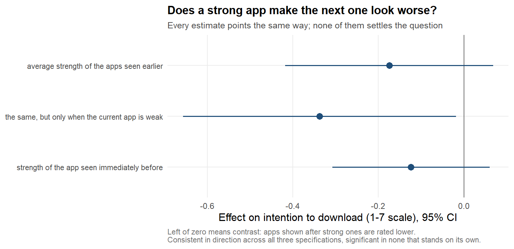
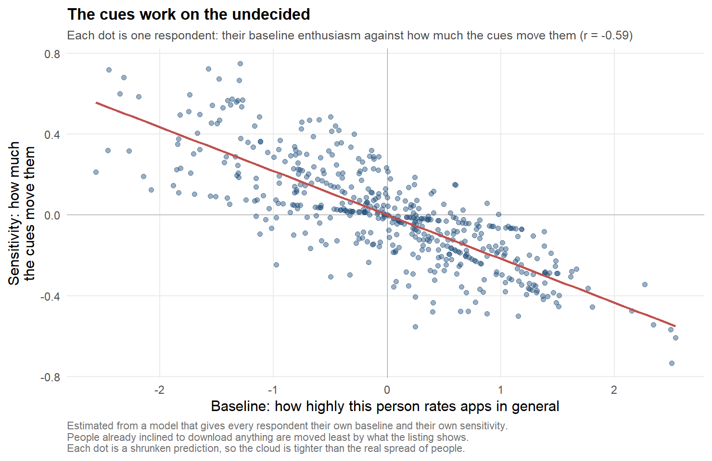
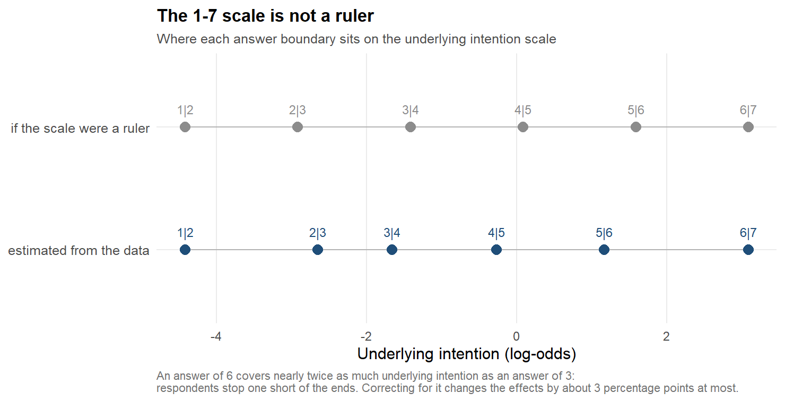
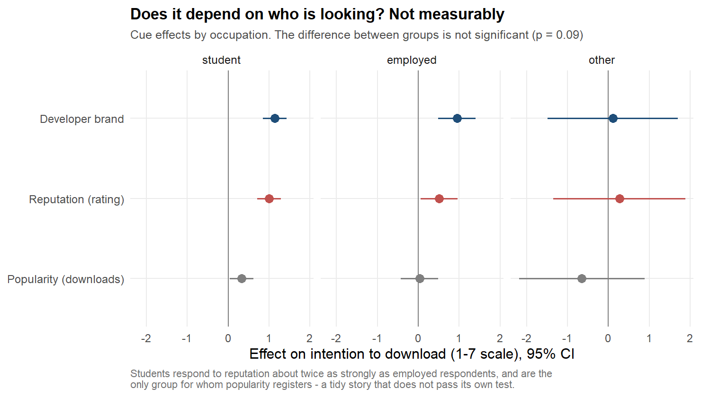
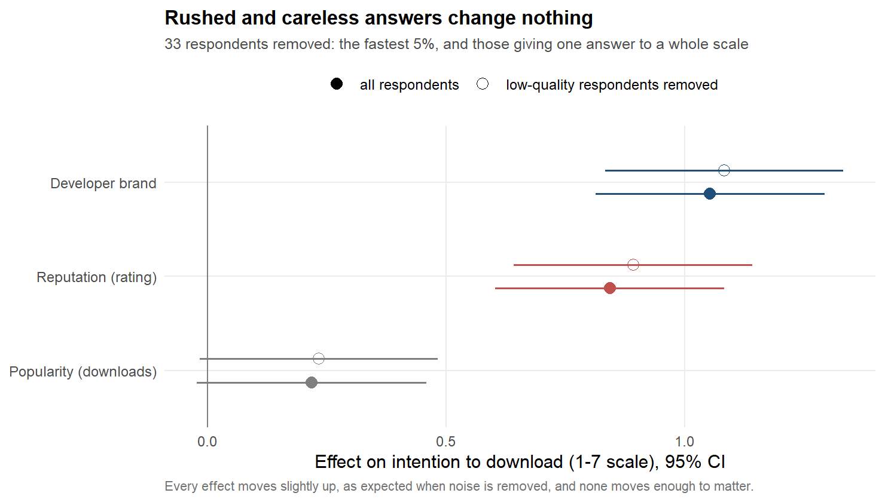
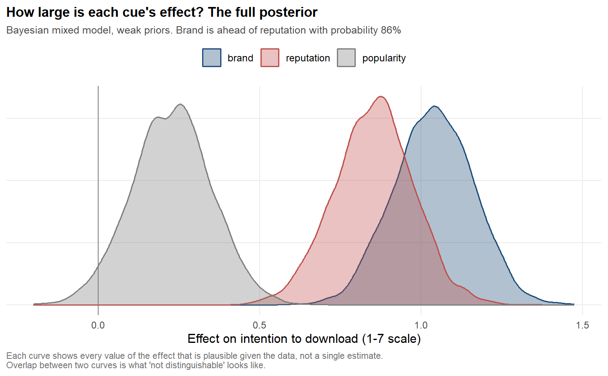

# New analyses: what else the 2023 data can answer

This document covers the analyses that go **beyond** checking the 2023 thesis. The review
([`01-review-of-2023-work.md`](01-review-of-2023-work.md)) asks whether the original
conclusions hold. This one asks what else the same 491 respondents can tell us.

Each section is built the same way: the **question**, why it is worth asking, the **method
explained from the beginning** for a reader who has never met that model, **what came back**,
and **how far the answer can be pushed**. Every number is produced by a numbered script in
[`../analysis/R/`](../analysis/R/) and appears in the matching log.

| Section | Question | Script | Work-plan task |
|---|---|---|---|
| [1](#1-a-primer) | What is a mixed model, and why is one needed here? | — | — |
| [2](#2-does-the-order-of-the-apps-matter) | Does what came before change the rating of what comes next? | `10_sequence_effects.R` | 2.1 |
| [3](#3-do-people-differ-in-what-moves-them) | Do people differ in what moves them? | `11_heterogeneity.R` | 2.2 |
| [4](#4-is-the-17-scale-a-ruler) | Is the 1–7 scale a ruler? | `12_response_scale.R` | 2.7 |
| [5](#5-does-it-depend-on-who-is-looking) | Does it depend on who is looking? | `13_demographics_quality.R` | 3.1 |
| [6](#6-does-response-quality-change-anything) | Do rushed or careless answers change anything? | `13_demographics_quality.R` | 3.3 |
| [7](#7-from-p-values-to-probabilities) | How probable is it that brand beats reputation? | `15_bayesian_brms.R`, `14_posterior_probabilities.R` | 2.6 |

---

## 1. A primer

Everything below rests on one idea, so it is worth setting out plainly.

**The problem.** Each of the 491 respondents rated three apps. Their three answers are not
three independent pieces of evidence: a person who is generally enthusiastic about apps gives
three high ratings, and a sceptic gives three low ones. Treating 1,473 answers as if they came
from 1,473 different people would overstate how much information there is. This is exactly the
mistake the original ANOVA made (review §3.1).

**The fix: a mixed model.** A mixed model splits each answer into two parts:

> answer = (what the app looks like) + (who this person is) + (noise)

The first part is shared by everybody and is what we want to estimate: how much a high rating,
a high download count or a strong brand moves the intention to download. The second part is a
**random intercept**: a personal offset, one number per respondent, telling us how far above or
below average that person sits. The model estimates the *spread* of those offsets rather than
each one separately, which costs one parameter instead of 491.

**Why it matters here.** The spread turns out to be large. The share of the total variation
that sits between people rather than within them — the **intraclass correlation**, or ICC — is
**0.41**. Two-fifths of the variation in intention has nothing to do with the apps shown; it is
just who is answering. A model that ignores this reports standard errors that are too small and
finds effects that are not there.

Two more ideas appear later and are explained where they arise: an **ordinal model** (§4), which
drops the assumption that the steps of a 1–7 scale are equally wide, and a **posterior
distribution** (§7), which turns estimates into probability statements.

---

## 2. Does the order of the apps matter?

**Question.** Each respondent saw three apps in a random order, and each app was randomly shown
in a strong or a weak version. Does the rating of the third app depend on *how strong the first
two were*?

**Why it is worth asking.** The thesis tried to get at this with its Model 2, but only on the
143–196 people who saw a given cue last. Because the levels were randomised independently, what
a respondent saw earlier is unrelated to who they are — which means it can be used as a
predictor without the usual worry that it stands in for something about the person. In long
format the same question uses all **982** observations from the second and third screens.

**Method.** For every observation after the first, two summaries of the past are built:

- `prior_mean_x` — the average strength (0 or 1) of the apps already seen;
- `prev_x` — the strength of the app seen immediately before.

Both enter a mixed model alongside the usual terms. The sign is what matters:

- a **negative** coefficient means **contrast**: after strong apps, the next one looks worse;
- a **positive** coefficient means **assimilation**: a strong predecessor lifts what follows.

**What came back.** Every estimate points the same way — contrast — and none of them is
convincing on its own.

| Model | Term | Estimate | SE | p |
|---|---|---|---|---|
| A | average strength seen earlier | −0.175 | 0.124 | 0.159 |
| B | average strength seen earlier | −0.338 | 0.163 | **0.038** |
| B | its interaction with the current app | +0.326 | 0.212 | 0.124 |
| C | strength of the immediately preceding app | −0.124 | 0.094 | 0.188 |

**How to read it, carefully.** The one result below 0.05 is the second row, and it is *not* the
headline it looks like. In model B the term measures the contrast effect **when the current app
is itself weak**; the interaction says the effect roughly disappears when the current app is
strong (−0.338 + 0.326 ≈ −0.012). That reading is only licensed if the interaction is real, and
the interaction is not significant (p = 0.124). Reporting "seeing strong apps earlier lowers the
rating of weak apps by a third of a point" would be selecting the one framing in which a number
crosses a threshold.

**Conclusion.** There is a consistent hint of a contrast effect, and no more than a hint. The
direction is worth carrying into a future design; the magnitude is not established here.

*Every specification points towards contrast; none of them settles the question.*

---

## 3. Do people differ in what moves them?

**Question.** All the models so far report one average effect per cue. Does that average
describe everybody, or does it hide a split between people who chase brands and people who read
ratings?

**Why it is worth asking.** The ICC of 0.41 says people differ in *how high they rate apps in
general*. That is not the interesting difference. The interesting one is whether they differ in
*how much the cues move them*, because that is what determines whether an average effect is a
useful guide to anything.

**Method.** The random intercept gives each respondent their own baseline. A **random slope**
additionally gives each respondent their own sensitivity to the manipulation — their personal
version of "how much does a strong app move me". If sensitivities genuinely vary, the model with
random slopes fits better than chance would allow, and a likelihood-ratio test detects it.

A third model was also attempted, giving each respondent their own level for each of the three
cues.

**What came back.**

| Model | Estimable | Fit vs baseline |
|---|---|---|
| own baseline only | yes | — |
| \+ own sensitivity to the manipulation | yes | **χ² = 9.47, 2 df, p = 0.0088** |
| \+ own level for each cue | **no** | — |

The middle model is the finding. Its variance components:

| Component | Standard deviation |
|---|---|
| Personal baseline | 1.135 |
| Personal sensitivity to the manipulation | **0.568** |
| Correlation between the two | **−0.59** |
| Remaining noise | 1.151 |

**How to read it.** Respondents really do differ in how much the cues move them, and the spread
is substantial: a sensitivity standard deviation of 0.57 against average effects of 1.05 (brand),
0.85 (reputation) and 0.22 (popularity). Someone one standard deviation below average barely
responds to the manipulation at all.

The correlation of −0.59 is the more interesting half. People with a high baseline — those
inclined to download almost anything — are moved *less* by the cues. The cues do their work on
the undecided, which is a different managerial message from "brand adds a point to everyone".

**Two honest qualifications.** First, this must be read as sensitivity *to the manipulation in
general*, not cue by cue: the model that would separate a personal brand-sensitivity from a
personal rating-sensitivity is the third one, and it cannot be estimated. That is not a numerical
accident. Each respondent saw each cue exactly once, so a personal level for each cue would need
three numbers per person from three observations per person — 1,473 parameters for 1,473
observations. The design is saturated by construction.

*Each dot is one respondent: baseline enthusiasm against sensitivity to the cues. The points are shrunken predictions, so the cloud is tighter than the real spread.*

Second, **this result contradicts what was written before running it.** The work plan (task 2.2)
predicted that three observations per respondent would be too few and that the model would
probably fail or return a variance of zero, and committed to reporting that negative outcome
rather than chasing a positive one. The outcome was the opposite, and the prediction is left in
the plan rather than quietly deleted. The likelihood-ratio test here is if anything conservative:
testing a variance against its lower boundary of zero makes the standard test too strict.

---

## 4. Is the 1–7 scale a ruler?

**Question.** Every model treats the answer scale as if the step from 1 to 2 meant the same as
the step from 6 to 7. Do respondents use it that way?

**Why it is worth asking.** If the middle of the scale is compressed, ordinary regression
distorts *small* effects most — and the smallest effect in this study is the one the entire
popularity argument turns on.

**Method, from the beginning.** An **ordinal model** makes no assumption about spacing. It
imagines a single continuous "intention" behind the visible answers and estimates six
**cutpoints** along it: below the first, a respondent answers 1; between the first and the
second, 2; and so on. If the scale were a ruler, those cutpoints would be evenly spaced.
Measuring how uneven they are says how wrong the ruler assumption is; re-estimating the effects
on a footing that does not depend on the spacing says whether it matters.

**What came back — the scale is not a ruler.**

| Cutpoint | Estimate | Gap to the next |
|---|---|---|
| 1 \| 2 | −4.42 | 1.77 |
| 2 \| 3 | −2.65 | 0.99 |
| 3 \| 4 | −1.66 | 1.39 |
| 4 \| 5 | −0.27 | 1.44 |
| 5 \| 6 | 1.17 | 1.93 |
| 6 \| 7 | 3.09 | — |

The widest answer band is **1.94 times** the narrowest. The range of underlying intention that
produces an answer of 6 — from the 5 | 6 cutpoint to the 6 | 7 cutpoint — is nearly twice as
wide as the range that produces a 3. (An earlier version described this as moving a respondent
"from 2 to 3"; the narrow band is the one that yields a 3, one step further along.) Respondents avoid
the ends of the scale, exactly as the literature on rating scales expects.

*Where each answer boundary sits on the underlying intention scale, against what an equally spaced scale would look like.*

**What came back — and it does not matter.** Both models were asked the same practical question:
by how many percentage points does the strong version of a cue raise the probability of an
answer of 5 or more? For the ordinal model this is computed for every observation at that
respondent's own characteristics and then averaged, so that the three cues are compared at
comparable points of the curve.

| Cue | Assuming equal spacing | Without that assumption | Difference |
|---|---|---|---|
| Brand | 25.9 pp | 27.1 pp | 1.3 |
| Reputation | 19.5 pp | 22.6 pp | 3.0 |
| Popularity | 6.0 pp | 6.7 pp | 0.7 |

The ranking, the magnitudes and the gap between the first two and the third all survive. **The
equal-spacing assumption is not driving any conclusion of this review** — which is worth knowing
precisely because it could have been.

**A caution about one number.** 22.6% of respondents never used an extreme answer and 17.3% used
one every time. A model allowing sensitivity to depend on that tendency finds a large interaction,
but "extremeness" is computed from the same three answers being explained and is itself partly a
consequence of the treatment. It is reported in the log as a description, and no conclusion rests
on it.

---

## 5. Does it depend on who is looking?

> **Not yet re-run on the corrected covariates (2026-09-18).** This section comes from
> `13_demographics_quality.R`, which needs the private questionnaire export and was not part
> of the re-run that followed the involvement-covariate correction (review §2.2). Its numbers
> are still the pre-correction ones. Every other section of this document has been
> re-run. Command, for whoever holds the export:
> `RAW_EXPORT=/path/to/export.csv Rscript analysis/R/13_demographics_quality.R`, then the
> same for `16_figures_extended.R`, which draws `fig_11` and `fig_12` from its output.

**Question.** Do age, gender, education or occupation change how much each cue matters?

**Why it is worth asking.** The thesis describes its sample demographically and then never uses
those variables. They were not even in the published datasets — they came back only with the raw
questionnaire export (review §2.4).

**Method.** Categories are collapsed first, because the originals are too thin: age becomes under
25 against 25 or older, occupation becomes student, employed or other, and so on. For each
variable, a model in which the cue effects are common to everybody is compared with one in which
they may differ by group. A likelihood-ratio test asks whether the second earns its extra
parameters.

**What came back — nothing significant.**

| Variable | χ² | df | p |
|---|---|---|---|
| Age | 8.56 | 6 | 0.200 |
| Gender | 11.48 | 12 | 0.489 |
| Education | 23.80 | 18 | 0.162 |
| Occupation | 18.94 | 12 | 0.090 |

Occupation comes closest, and the pattern behind it is at least coherent:

| Group | Brand | Reputation | Popularity |
|---|---|---|---|
| Students (69% of the sample) | 1.14 *** | 1.00 *** | 0.33 * |
| Employed | 0.94 *** | 0.51 * | 0.03 |
| Other | 0.11 | 0.27 | −0.65 |

**How to read it.** Students respond to reputation about twice as strongly as employed
respondents do, and they are the only group for whom popularity registers at all. It is a tidy
story and it does not pass its own test (p = 0.090 before any correction for having tried four
variables). The "other" group is small enough that its estimates carry standard errors around
0.8 and say nothing.

The more important point is what this cannot show. With 69% students, the sample has very little
room to detect differences between occupations, and none of these tests should be read as
evidence that the cue effects are the same for everyone. They are evidence that *this sample*
cannot tell them apart.

*Cue effects by occupation. A coherent pattern that does not pass its own test.*

---

## 6. Does response quality change anything?

> **Not yet re-run on the corrected covariates (2026-09-18).** This section comes from
> `13_demographics_quality.R`, which needs the private questionnaire export and was not part
> of the re-run that followed the involvement-covariate correction (review §2.2). Its numbers
> are still the pre-correction ones; for the full-sample column below the corrected values are 1.050, 0.848 and 0.221. Every other section of this document has been
> re-run. Command, for whoever holds the export:
> `RAW_EXPORT=/path/to/export.csv Rscript analysis/R/13_demographics_quality.R`, then the
> same for `16_figures_extended.R`, which draws `fig_11` and `fig_12` from its output.

**Question.** Some respondents rushed, and some gave the same answer to every item of a scale.
Do the conclusions depend on keeping them?

**Method.** Two flags, both computed from the raw export: completion time in the fastest 5%
(under 97 seconds, against a median of 190), and giving an identical answer to all eight items of
the category-involvement scale — a classic sign of someone clicking straight down the page. 33
respondents are flagged by one or the other; 11 by the flat-scale rule.

**What came back.**

| Cue | All respondents | Flagged respondents removed |
|---|---|---|
| Brand | 1.053 | 1.082 |
| Reputation | 0.842 | 0.891 |
| Popularity | 0.218 | 0.233 |

Every effect moves slightly *up*, which is the expected direction if careless answers add noise,
and none moves enough to change anything. Popularity remains short of significance either way.

**Conclusion.** The conclusions of this review do not rest on the respondents who rushed or
answered flatly. This is the cheapest robustness check in the whole project and it is the kind
that is most often skipped.

*Removing the 33 flagged respondents moves every effect slightly up and changes nothing.*

---

## 7. From p-values to probabilities

**Question.** How probable is it that brand really beats reputation?

**Why the usual answer does not work.** A p-value of 0.22 does not mean a 22% chance that the two
are equal. It means that *if* they were exactly equal, data at least this extreme would appear
22% of the time. The question a reader actually asks is the reverse: given these data, how likely
is the statement true?

**Method, from the beginning.** Answering the reversed question needs a probability distribution
over the effects themselves, called a **posterior**: instead of one best estimate per coefficient
plus a standard error, a whole range of values with a plausibility attached to each. The model is
the same mixed model used everywhere else, estimated by a sampler that explores those ranges —
four independent chains of 2,000 iterations each. Every statement of interest is then checked
against every draw, and the share of draws in which it holds is its probability.

**Priors.** Deliberately weak: a normal(0, 2) on every effect, on a 1–7 answer scale where the
largest observed effect is about 1.5. That says only that effects of five or six scale points are
implausible, and leaves everything the data might plausibly show untouched.

**Did the sampler work?** Yes: the largest R-hat is 1.001 for the first model and 1.010 for the
second, against a conventional ceiling of 1.01, the effective sample sizes are above 1,100
everywhere, and there were no divergent transitions. These are the diagnostics that say the
answer below can be trusted as an answer *to this model*.

**A note on how this was obtained.** For most of this project the numbers below came from an
approximation, because no Stan model could be compiled on this machine — `rstan` fails inside its
own compilation wrapper, for reasons documented in §2.6 of
[`02-work-plan.md`](02-work-plan.md). `cmdstanr`, which carries its own copy of Stan and bypasses
`rstan` entirely, was then installed and works. The numbers below are from the real model.

The approximation was kept rather than deleted, and the two are compared in
[`15_bayesian_brms.R`](../analysis/R/15_bayesian_brms.R). They agree: across sixteen statements
the largest disagreement is **3.9 percentage points**, four exceed 2.5, and the other twelve are
below 1.9. (Before the covariate correction of 2026-09-18 the largest was 2.9.) That comparison is
worth more than either result alone, because it is the only way to know whether the work done on
the approximation was resting on anything.

**What came back.**

| Statement | Probability | Approximation |
|---|---|---|
| The brand effect is positive | 100% | 100% |
| The reputation effect is positive | 100% | 100% |
| The popularity effect is positive | 96.7% | 96.6% |
| Brand is ahead of reputation | **86.4%** | 88.2% |
| Brand is ahead of popularity | 100% | 100% |
| The whole ranking brand > reputation > popularity holds | 86.4% | 88.1% |
| Brand and reputation are within 0.33 points of each other | 80.4% | 77.2% |
| The popularity effect is smaller than 0.33 points | 80.3% | 81.6% |
| Brand is ahead of reputation **before** any comparison | **98.6%** | 99.1% |
| Brand is ahead of reputation **after** other apps were seen | **47.6%** | 44.1% |
| The brand–reputation gap shrinks once other apps are seen | 97.1% | 97.9% |
| The popularity effect is positive before any comparison | 99.0% | 99.0% |

The posterior medians are 1.04 for brand (95% interval 0.80 to 1.27), 0.86 for reputation (0.61
to 1.09) and 0.23 for popularity (−0.02 to 0.47) — the same numbers the frequentist models give,
which is what should happen when the priors are this weak.

*The full posterior of each effect. Overlap between two curves is what "not distinguishable"
looks like.*

**How to read it, and how not to.** These numbers are not new evidence. They come from the same
model and the same data as the frequentist results, so they cannot disagree with them — only
phrase them differently. "Brand ahead of reputation: 88.2%" is the same fact as "p = 0.24 for the
difference": a two-sided p of 0.24 corresponds to about 0.12 on one side, and 1 − 0.12 ≈ 0.88. If
the p-value did not convince you, this should not convince you either.

What the reformulation genuinely adds is the last four rows. "98.6% before comparison, 47.6%
after" states the position-dependence of the ranking (review §12.1) in a form that needs no
training to read: before the user has seen anything else, brand almost certainly leads; once they
have, it is a coin toss.

---

## 8. What these analyses change

Nothing in the review's conclusions is overturned here. Three things are added:

1. **People differ in how much the cues move them** (§3), and the ones easiest to move are the
   ones least inclined to download anything anyway. This is new, significant, and contradicts the
   expectation recorded before the test was run.
2. **The conclusions are robust to the technical choices that could have undermined them**: the
   equal-spacing assumption of the answer scale (§4), the demographic composition of the sample
   (§5) and the presence of careless respondents (§6).
3. **The ranking is position-dependent, and now quantified as a probability** (§7): near-certain
   before comparison, a coin toss after it.

And one hint that is not a finding: a contrast effect from the apps seen earlier (§2), consistent
in direction across every specification, significant in none of them that can be read without
conditioning on an untested interaction.

## 9. What would need a different study

| Question | What this design cannot do | What would be needed |
|---|---|---|
| Is a given person brand-driven or rating-driven? | Each respondent sees each cue once, so the model is saturated (§3) | Several apps per cue per respondent |
| How large is the contrast effect from earlier apps? | Direction consistent, magnitude unresolved (§2) | A design that manipulates the sequence deliberately rather than by randomisation alone |
| Do cue effects differ by occupation or age? | 69% of the sample are students (§5) | A sample recruited for demographic spread |
| Does popularity matter at all? | The low-popularity stimulus was internally impossible (review §3.3) | A corrected stimulus, and download counts that are credible against the review count |
| How do intentions translate into downloads? | Nothing in these data links the 1–7 scale to behaviour | Field data, or a design with a real download step |
